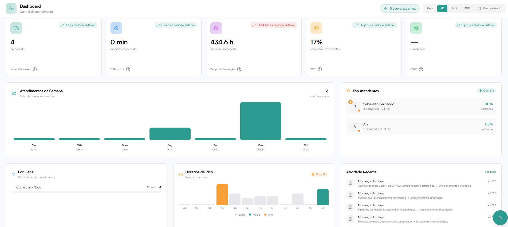
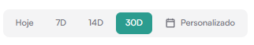
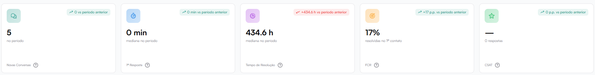
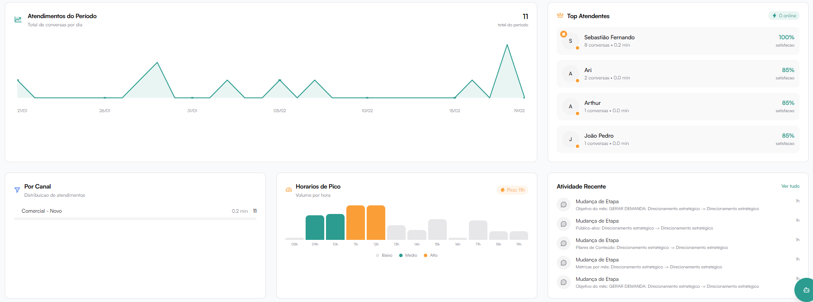

# Dashboard

{/* 

  <iframe
    src="https://www.youtube.com/embed/Bedlh7HeViE?si=8rIkWE30TbAtajnL"
    title="YouTube video player"
    frameborder="0"
    allow="accelerometer; autoplay; clipboard-write; encrypted-media; gyroscope; picture-in-picture; web-share"
    referrerpolicy="strict-origin-when-cross-origin"
    allowfullscreen
    loading="lazy"
  ></iframe>

 */}

--- 

A **DashBoard** é a sua tela inicial, o primeiro espaço que você vê ao fazer *login*. 

O Dashboard é a **central** de **monitoramento** da operação de atendimento.

Nesta tela é possível acompanhar, em tempo real, o **volume** de conversas, **tempos** de resposta, **desempenho** da equipe e **indicadores** estratégicos.

Ele foi projetado para **responder** rapidamente às **seguintes** **perguntas**:

- Quantas conversas recebemos?
- Estamos respondendo com agilidade?
- Por que os atendimentos estão sendo encerrados?
- Quantos novos contatos chegaram?
- Quais os horários de maior demanda?
- Como está a performance da equipe?

### Conversas Ativas

No canto superior direito da tela, ao lado dos filtros de período, existe um indicador em tempo real que mostra quantas conversas estão acontecendo neste momento na plataforma. Esse número é atualizado automaticamente, sem precisar recarregar a página.

### Filtro de Período

No canto superior direito da tela é possível selecionar o **período** de **análise**:

- Hoje
- 7D
- 14D
- 30D
- Personalizado

Todas as métricas do Dashboard são **recalculadas** automaticamente conforme o período selecionado.

:::warning Importante
Os **indicadores** exibem a variação em relação ao período anterior equivalente.

**Exemplo**: ao selecionar 7D, o sistema compara com os 7 dias anteriores.

Indicadores em **verde** representam **melhoria**.
Indicadores em **vermelho** representam **queda** de **desempenho**.
:::

## Métricas Principais

Os **cards** **superiores** apresentam os indicadores estratégicos da operação.

### Novas Conversas

Exibe o total de **conversas** iniciadas no período **selecionado**.

O que indica:
- **Volume** de demanda recebida
- **Crescimento** ou redução no fluxo de atendimento

Como usar esse dado:
- **Planejar** **dimensionamento** da equipe
- **Identificar** **crescimento** de leads
- **Monitorar** campanhas ativas

### 1ª Resposta

Mostra o **tempo** **mediano** da **primeira** **resposta** enviada ao cliente.

Por que é importante?
Quanto menor o tempo de primeira resposta:
- Maior a **percepção** de agilidade
- Maior a **chance** de conversão
- Melhor a **experiência** do cliente

Boa prática:
Operações comerciais devem buscar manter a primeira resposta abaixo de 5 minutos.

### Tempo de Resolução

Exibe o **tempo** mediano necessário para **finalizar** uma **conversa**.

O que avalia:
- Eficiência operacional
- Complexidade dos atendimentos
- Capacidade da equipe em resolver demandas

Atenção:
Um tempo de resolução muito alto pode indicar:
- Processos internos ineficientes
- Necessidade de treinamento
- Problemas de roteamento

### Atendimentos por Demanda

Mostra o total de **conversas encerradas** no período e detalha o motivo pelo qual cada uma foi finalizada.

Abaixo do número total, o card exibe uma lista com a distribuição percentual dos motivos de encerramento. Exemplos de motivos que podem aparecer:

- **Sem resposta** → O cliente não respondeu e a conversa foi encerrada automaticamente.
- **Sem motivo informado** → A conversa foi encerrada sem que um motivo fosse registrado pelo atendente.
- **Fora do horário** → O atendimento foi encerrado por conta do horário de funcionamento.

Essa métrica ajuda a entender não apenas quantos atendimentos foram concluídos, mas também **por que** foram encerrados, revelando padrões que podem indicar pontos de melhoria na operação.

### Novos Contatos

Exibe o total de **contatos que enviaram a primeira mensagem** para a plataforma no período selecionado.

Diferente de "Novas Conversas", que conta todas as conversas iniciadas, esta métrica foca especificamente em **pessoas que nunca haviam entrado em contato antes**, representando o crescimento real da base de clientes.

Como usar esse dado:
- Medir o alcance de campanhas de aquisição
- Acompanhar o crescimento da base de contatos
- Identificar períodos de maior entrada de novos clientes

### CSAT (Customer Satisfaction)

Mostra o índice de **satisfação** dos **clientes** com base nas avaliações recebidas após o atendimento.

Para que serve?
- **Medir** qualidade percebida
- **Identificar** pontos de melhoria
- **Avaliar** desempenho individual

## Gráficos

Os **gráficos** do Dashboard oferecem uma **visão visual** e **estratégica** da operação de atendimento.
Eles permitem identificar **padrões**, **comportamentos** recorrentes e **oportunidades** de melhoria de forma rápida e intuitiva.

Por meio dessas visualizações é **possível** analisar volume de conversas, desempenho da equipe, distribuição por canal e horários de maior demanda, facilitando a tomada de decisão baseada em dados.

Cada **gráfico** foi projetado para **apoiar** tanto a **gestão** operacional diária quanto o **planejamento** estratégico da equipe.

### Atendimentos da Semana / Atendimentos do Período

Este gráfico muda de nome dependendo do período selecionado:

- Quando o período é **14D, 30D ou Personalizado**, ele se chama **"Atendimentos do Período"** e exibe um gráfico de linha mostrando a evolução do volume de conversas ao longo das datas do intervalo selecionado.

No canto superior direito do gráfico é exibido o total de conversas do período.

Como interpretar:
- Picos indicam dias de maior volume.
- Quedas podem indicar menor demanda ou problemas de operação.
- Ajuda a identificar padrões recorrentes ao longo do tempo.

Aplicação prática:
- Ajustar escala de atendentes
- Antecipar dias de maior demanda
- Planejar campanhas

### Top Atendentes

Exibe os **atendentes** com melhor **desempenho** no período selecionado, ordenados pelo índice de satisfação.

No canto superior direito do card aparece o indicador **"X online"**, mostrando quantos atendentes estão conectados à plataforma naquele momento. O ponto colorido ao lado do nome de cada atendente também indica o status: verde para online e cinza para offline.

Informações exibidas por atendente:
- Nome do atendente
- Número de conversas atendidas
- Tempo mediano de atendimento
- Índice de satisfação (%)

Objetivo estratégico:
- Reconhecer alto desempenho
- Identificar padrões de excelência
- Detectar oportunidades de melhoria

### Por Canal

Apresenta a **distribuição** das **conversas** conforme o canal de atendimento.

Cada linha exibe:
- **Nome do canal** (ex: Comercial - Novo)
- **Tempo mediano de atendimento** naquele canal
- **Volume total de conversas** no período

Aplicações:
- Entender de onde vem a maior demanda
- Identificar gargalos por canal
- Avaliar impacto de campanhas específicas em cada origem

### Horários de Pico

Mostra o **volume** de **atendimentos** **distribuído** por hora ao longo do dia, usando cores para facilitar a leitura:

- **Cinza** → Volume baixo
- **Verde** → Volume médio
- **Laranja** → Volume alto (pico)

No canto superior direito do card é destacado automaticamente o **horário de maior pico** do dia (ex: "Pico: 11h"), facilitando a identificação imediata do momento de maior demanda.

Importância:
- Ajustar escala de atendimento
- Reduzir fila em horários críticos
- Melhorar tempo de resposta

## Atividade Recente

Lista as **ações** recentes **realizadas** na **plataforma**, como:

- Mudança de etapa no funil
- Atualizações de status
- Movimentações internas

Cada item exibe a descrição da ação e há quanto tempo ela aconteceu (ex: 22 min, 1h).

No canto superior direito do card existe o botão **"Ver tudo"**, que abre o histórico completo de atividades da operação, sem limitar aos itens exibidos no resumo.

Finalidade:
- Auditoria operacional
- Acompanhamento de progresso
- Controle de fluxo interno

## Como Usar o Dashboard para Tomada de Decisão

O Dashboard não é apenas **informativo** — é **estratégico**.

Você pode **utilizá**-lo para:

- Ajustar dimensionamento da equipe
- Identificar gargalos operacionais
- Melhorar SLA de resposta
- Monitorar qualidade de atendimento
- Avaliar impacto de campanhas

## Boas Práticas

- **Analise** o Dashboard diariamente
- **Compare** períodos equivalentes
- **Combine** dados de volume e qualidade
- Use os gráficos para **planejamento** semanal
