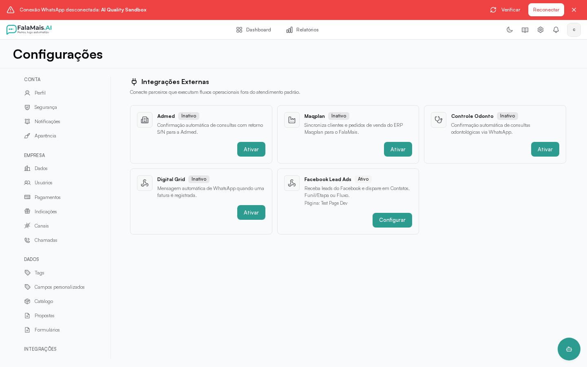

# Integração com Facebook Lead Ads

A integração com **Facebook Lead Ads** traz para o FalaMais.AI os leads
capturados pelos formulários dos seus anúncios no Facebook. Assim que alguém
preenche um formulário de lead, o contato entra na plataforma sem trabalho
manual.

## O que você pode fazer

- **Conectar a Página do Facebook** que recebe os formulários de lead.
- **Definir o destino de cada formulário**:
  - Só salvar em **Contatos**;
  - Cair em um **Funil e Etapa**;
  - Disparar um **Fluxo** (automação);
  - Funil + Fluxo ao mesmo tempo.
- **Acompanhar o histórico** de cada lead recebido: formulário, página,
  status do processamento e erros, se houver.

## Como configurar

1. Acesse **Configurações → Integrações** e abra **Facebook Lead Ads**.
2. Clique em **Conectar com Facebook (OAuth)** e autorize a página que
   recebe os leads. Também é possível conectar manualmente com o ID da
   página e um token de acesso.
3. Em **Mapeamentos por Formulário**, clique em **Novo mapeamento**, informe
   o ID do formulário e escolha o destino (Contatos, Funil/Etapa, Fluxo ou
   ambos).
4. Ative a integração no interruptor **Ativar integração**.

## Como o lead é tratado

- O telefone é o principal identificador: se o número já existe nos seus
  contatos, as informações são atualizadas; caso contrário, um novo contato
  é criado.
- O contato pode ser movido para o funil/etapa escolhido e o fluxo
  selecionado é disparado.
- Os campos do formulário são mapeados automaticamente para telefone, nome,
  e-mail e empresa quando disponíveis.

## Recebimento em períodos de maior movimento

Os leads recebidos entram em processamento em segundo plano. A confirmação de
recebimento pode acontecer antes de o contato, o funil ou o fluxo aparecerem
atualizados. Consulte o histórico da integração para acompanhar o resultado e
os erros de cada lead.

Durante picos de entrada, os leads são processados gradualmente para reduzir a
competição com o atendimento. Se a capacidade de recebimento estiver ocupada,
a integração solicita uma nova tentativa ao sistema de origem. Não é necessário
recriar o mesmo lead manualmente enquanto seu processamento está pendente.

## Webhook e verificação

O FalaMais.AI recebe os eventos do Facebook por webhook. A verificação do
endpoint (`verify_token`) e a assinatura das mensagens são validadas
automaticamente com o segredo do aplicativo da Meta. Para ambiente de
desenvolvimento, a verificação de assinatura pode ser liberada
explicitamente — nunca em produção.
