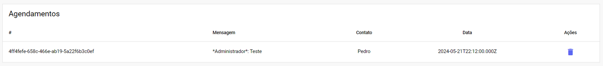
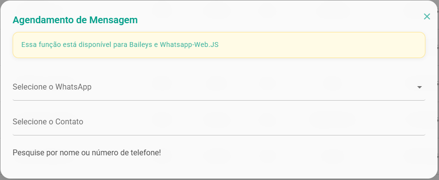
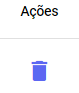

# Visualização de Agendamentos

O objetivo desta seção é listar e organizar todas as **mensagens programadas** para envio. Aqui você encontra um registro completo das comunicações que serão disparadas automaticamente aos seus clientes em datas futuras.

## Agendar Mensagem Avulsa

Você pode agendar uma mensagem tanto durante um atendimento diretamente com o cliente ou pode agendar uma mensagem avulsa por aqui

Para agendar uma nova mensagem, comece selecionando o **Canal** de **WhatsApp** desejado e, em seguida, escolha o **contato**. Você terá diversas opções de personalização: defina a **data e hora** do envio, adicione **emojis** ou **anexos**, e configure a **recorrência** (frequência e número de repetições) se a mensagem for periódica.

E Utilize a coluna **Ações** para excluir uma mensagem agendada que não será mais enviada.

