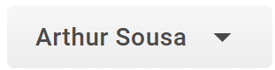
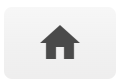
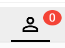

# Lista de Atendimento

## Introdução

Esta é a seção principal do sistema, onde sua equipe interage diariamente com os clientes. Uma caixa de entrada unificada, criada para centralizar e gerenciar todos os tipos de conversas em um único lugar.

Para acessar basta clicar no ícone de ***Atendimentos*** no menu lateral.

## Estrutura da Tela de Atendimento

Temos muitas funcionalidades a serem acessadas, vamos começar pelo Menu superior:

### Menu superior esquerdo (Barra de ações)

Localizada no topo da tela à esquerda, temos diversas funcionalidades/botões, como:

<!-- - Botão de perfil, com nome do usuário: 
  - Perfil: Você pode editar informações do usuário, como nome, senha e email.
  - Reiniciar: Limpa dados salvos no navegador e desloga da conta.
  - Sair: Desloga da conta.
- Chat interno: Chat interno entre os usuários e equipe.
- Criar tarefas: É possível criar tarefas de acordo com os campos.
- Retornar ao Menu: Você volta para página inicial.
- Listagem das conversas:
  - Listar atendimentos privados.
  - Listar atendimentos em grupo.
- Filtro Avançado: É possível listar os atendimentos com base no filtro que você quer.
- Contatos: Apresenta uma lista de contatos, no qual você pode procurar, filtrar, adicionar, excluir.
- Carregar mais atendimentos. -->

| Descrição                       | Aparência                                          |
|---------------------------------|----------------------------------------------------|
| Botão de perfil              |           |
| Chat interno              |           |
| Criar tarefas              |           |
| Retornar ao menu              |           |
| Conversas Privadas              |           |
| Conversas de Grupos             |            |
| Filtros Avançados               |           |
| Pesquisa                        |            |
| Contatos                        |            |
| Carregar mais Conversas         |           |
| Abrir integração com Wavoip     |            |
| Enviar mensagem avulsa          |            |
| Inverter a ordem dos tickets    |            |
| Buscar ticket por mensagem      |            |

### Área de Conversa (Painel central)

A área de conversa funciona de forma semelhante ao WhatsApp: você pode enviar mensagens de texto, áudios, anexos, mensagens rápidas, emojis e até links para videoconferências.

Existe também a opção de ativar ou desativar a assinatura do usuário. Quando ativada, o nome do usuário aparece junto à mensagem enviada ao cliente; se estiver desativada, a mensagem será enviada sem identificação do usuário.

E, caso você tenha configurado a chave do GPT, é possível utilizar a IA para reescrever suas mensagens em quatro estilos diferentes:

- **Profissional:** Tom formal e corporativo.
- **Simpático:** Tom amigável e acolhedor.
- **Marketing:** Tom persuasivo e envolvente.
- **Ortografia:** Corrige erros ortográficos automaticamente.

- Profissional: Tom formal e corporativo.
- Simpático: Tom amigável e caloroso.
- Marketing: Tom persuasivo e envolvente.
- Ortografia: corrigindo erros ortográficos.

### Dados do Contato (Painel lateral direito)