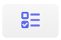

# Lista de Atendimento

## Introdução

Esta é a seção principal do sistema, onde sua equipe interage diariamente com os clientes. Uma caixa de entrada unificada, criada para centralizar e gerenciar todos os tipos de conversas em um único lugar.

Para acessar basta clicar no ícone de ***Atendimentos*** no menu lateral.

## Funcionalidades do Chat

Vamos iniciar um overview de toda a área do atendimento. Para começar, vamos falar do botão no canto superior esquerdo. Aqui ficará o nome do usuário e ao clicar aparecerá as seguintes opções: Perfil e Sair

Clicando em Perfil, abrirá um pop up para editar as informações do usuário. Observe o exemplo:

E clicando em Sair, realizará o logout sem precisar retornar ao menu. Aliás, para fazer esse retorno, basta clicar no botão de [Home](../painel.md)

Clicando no botão abaixo, você será direcionado ao [Chat Interno](../organizacaoInterna/chat.md).

Clicando no botão abaixo, você poderá criar um [Tarefa Nova](../organizacaoInterna/tarefa.md).

| Descrição                       | Aparência                                          |
|---------------------------------|----------------------------------------------------|
| Conversas Privadas              |           |
| Conversas de Grupos             |           |
| Filtros Avançados               |           |
| Pesquisa                        |           |
| Contatos                        |           |
| Carregar mais Conversas         |           |
| Abrir integração com Wavoip     |           |
| Enviar mensagem avulsa          |           |
| Inverter a ordem dos tickets    |            |
| Buscar ticket por mensagem      |           |
| Atendimentos em andamento     |            |
| Atendimentos não iniciados     |           |
| Atendimentos finalizados      |           |

A depender de qual dos botões tenha sido selecionado (aberto, pendente ou fechado) você visualizará os contatos correspondentes.

Já na segunda tela, quando uma conversa é selecionada, a visão é essa:

No canto superior esquerdo é possível ver a foto, nome do cliente, a quem foi atribuído o atendimento e o ticket do atendimento.

À direita estão alguns botões de ação, que facilitam o atendimento. Conheça cada um deles:

### Barra de Ferramentas do Atendimento

| Descrição                       | Aparência                                          |
|---------------------------------|----------------------------------------------------|
| Reabrir Ticket: Retome um atendimento que já foi finalizado.              |           |
| Agendamento de Mensagem: Realize o agendamento de uma mensagem individual para esse contato. Essa mensagem pode conter áudio, arquivo, emoji, etc.            |          |
| Retornar Ticket para a fila: Direcione o contato de volta para o fim da fila de atendimento. Um novo usuário poderá dar continuidade a esse atendimento.              |           |
| Resolver: Finalize esse atendimento. O contato que estiver na aba Aberto irá automaticamente para aba Fechado.                       |           |
| Transferir: Transfira o atendimento para o setor e usuário que dará continuidade ao atendimento desse cliente.                        |          |
| Chatbot: Transfira o atendimento para um fluxo de chatbot interno.         |           |
| Canal: Transfira o atendimento para outro canal     |          |
| Reabrir chamada: reabra uma chamada do Wavoip em andamento         |          |
| Compartilhar o atendimento com outro usuário         |         |

### Chat com Cliente 

Na parte inferior da tela é onde seus usuários vão se comunicar com o cliente. À esquerda se encontram os botões de: envio de arquivo, emoji, link para vídeo chamada e figurinhas.

Aqui também é possível ativar e desativar a assinatura que identifica seus colaboradores no atendimento.

Ao lado está o campo de escrita das mensagens, o atalho de mensagens rápidas e botão para envio de áudio.

## Menu Lateral

No canto direito está o menu lateral com os dados do cliente. No primeiro campo você visualiza foto, nome, número e possui a opção de editar o contato.

**Logs e Marcar como Lido/Não Lido:** com a linha do tempo de acessos que os usuários fizeram a esse atendimento. Ao lado dos logs você também pode marcar o atendimento como lido ou não lido.

### Funil

Gere oportunidades com o funil.

### Protocolo 

Gere protocolos para seus atendimento. Para saber mais, leia a seção [Protocolos](../ferramentaAtendimento/protocolo.md) da central de ajuda.

### Avaliação 

Você pode enviar uma pesquisa de avaliação do atendimento. Para mais informações, leia a seção Avaliações da central de ajuda.

### Nota

Registre uma nota para controle dos atendimentos. Para saber mais, leia a seção [Notas](../ferramentaAtendimento/nota.md) da central de ajuda.

### Extrair conversas
 
Ao opção permite que você baixe as conversas do atendimento em um arquivo no formato PDF.

### ChatGpt

Ative ou desative a interação com ChatGpt para o atendimento. Essa opção estará disponível caso a interação esteja ativa nas configurações gerais. Para saber mais, leia a seção Configurações e Canais da central de ajuda.

### Kanban

Selecione um Kanban previamente cadastrado para um melhor Controle Visual de Atendimentos. Leia a seção [Kanban](../kanban.md) da central de ajuda. Para saber mais, leia a seção Notas da central de ajuda.

Remova o Kanban no ícone abaixo:

### Demanda

Selecione uma Demanda, previamente cadastrada. Leia a seção Demanda da central de ajuda. 

Remova a Demanda no ícone abaixo:

### Valor

Informe um valor monetário no atendimento.

### Bloquear

Ativando essa opção não serão mais recebidas mensagens desse contato dentro da plataforma.

### Bloquear Chatbot

Ativando essa opção esse contato não irá interagir com o chatbot interno.

### Etiqueta

Atribua uma etiqueta para auxiliar na classificação do atendimento. Clique no símbolo de + e selecionar qual etiqueta melhor se encaixa. Para saber mais, leia a seção [Etiquetas](../ferramentaAtendimento/etiqueta.md) da central de ajuda.

### Carteira 

A carteira serve para que possa atribuir um usuário fixo para o atendimento de um contato. Ou seja, caso tenha um cliente recorrente você consegue alocar todos os atendimentos dele para o usuário que melhor atenda o seu perfil. Para isso basta clicar no símbolo de + e selecionar no usuário.

### Mensagens Agendadas

Você pode visualizar quantas mensagens foram agendadas através do botão de agendamento. Além disso é possível ver o conteúdo, data e horário de envio. Para saber mais, leia a seção [Agendamentos](../ferramentaAtendimento/agendamento.md) da central de ajuda.

### Sanitinzar contatos

Essa rotina recria o usuário e fecha todos os tickets associados a esse contato.

