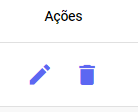

# Avalições de Atendimento

Os dados dessas **avaliações** alimentam diversas áreas do seu painel, como o **Dashboard** e o **Resumo de Atendimentos de Usuários.** Eles servem como um termômetro excelente para medir a performance da sua equipe de atendimento, tanto em vendas quanto em suporte.

## Enviar Avaliação

As avaliações são enviadas no menu lateral do painel de atendimento. Role o mouse até chegar ao bloco de ***Avaliação***.

Clicando em **Enviar**, uma pesquisa de satisfação será enviada na conversa. Assim que o contato responder com um número de 0 a 5, essa resposta será armazenada. Veja o exemplo:

Já em **Logs**, o usuário pode visualizar todos os registros de avaliação enviada para aquele contato, organizados por ordem cronológica.

## Gerenciar Avaliações

Na parte inferior do painel de **Avaliações**, você pode visualizar informações como: **Nota** de **Avaliação**, **Usuário** que enviou a pesquisa de satisfação, **Número** do **Ticket** de **Atendimento** e **Data** que a **Avaliação** foi enviada.

Em **Ações** você pode **Editar** a nota da avaliação, quantidade de tentativas e o número do Ticket. Clicando no ícone de lixeira você **Exclui** a avaliação.

## Configurar Avaliações

A **personalização** da sua avaliação é realizada por meio do ícone de acesso **rápido** localizado na parte superior desta interface. Clique nele para abrir as opções de **configuração**.

Em seguida, você verá a tela para personalizar a sua avaliação.

Na parte inferior do painel de **Avaliações**, você pode visualizar informações como: **Tipos de Avaliações** (Avaliação: Valor atribuído de 0 a 5) e **Mensagem** enviada para cada avaliação.

Você tem a liberdade de **personalizar** a mensagem de resposta para cada **nota** da avaliação. É possível incluir **links** de formulário (por exemplo, para feedback detalhado em atendimentos muito bons ou muito ruins) ou apenas uma mensagem de texto. 

:::tip dica
Se você não customizar uma nota específica, o sistema enviará a mensagem padrão definida no campo 'Mensagem de avaliação armazenada com sucesso'.
:::

Você também pode customizar as mensagens exibidas em casos de erro e na tentativa de armazenamento dos dados.

