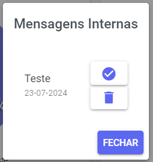
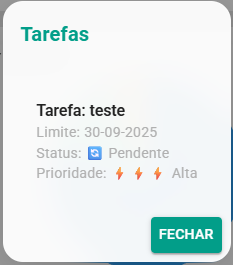
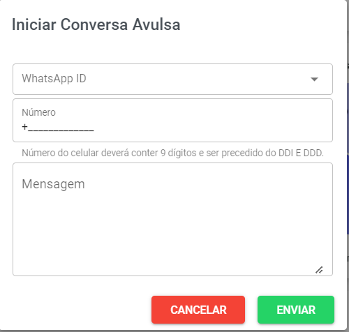
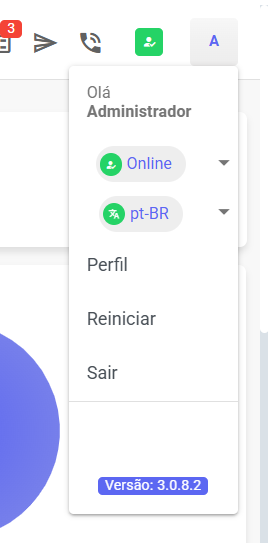

# Barra de Ferramentas

No topo da página, você encontra uma barra de ferramentas rápidas que oferece diversas funcionalidades para facilitar o uso no dia-a-dia.

## Notificações

Sempre que uma nova mensagem de atendimento chegar, você será notificado imediatamente nesta área.

## Mensagens Internas

Visualize mensagens internas com outros usuários da plataforma de forma prática e rápida.

## Tarefas

Acompanhe suas tarefas pendentes e mantenha o controle das atividades que precisam ser realizadas.

## Conversas Avulsas

Envie mensagens avulsas para qualquer usuário, mesmo sem ter iniciado um atendimento formal.

## Ligações

Após configurar o *Wavoip*, é possível realizar ligações diretamente pela plataforma.

## Perfil

No botão de perfil, você pode:
- Visualizar seu nome e status (online/offline).
- Alterar o idioma do sistema (Português, Inglês, etc.).
- Editar informações pessoais, como nome, senha e e-mail.
- Reiniciar: limpa os dados salvos no navegador e faz logout.
- Sair: encerra sua sessão na plataforma.