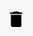

# Lista de Contatos

Esta seção apresenta a listagem de todos os contatos, juntamente com funcionalidades adicionais para facilitar a gestão e interação.

## Campo de busca

Logo no início, há um campo de busca que permite localizar contatos pelo **nome** ou **número** **de** **telefone**.

## Filtros 

Você pode filtrar os contatos por **carteira**:

E também pode filtrar por **etiquetas**.

## Adicionar um número

Aqui você pode cadastrar um número preenchendo os seguintes campos:

| Campo                    | Descrição                                                                                                                        |
| :------------------------| :------------------------------------------------------------------------------------------------------------------------------- |
| **Nome**     | Insira um nome para identificar esse contato. |
| **Número**   | Número do celular deverá conter 9 dígitos e ser precedido do **DDI** (código do país) E **DDD**. |
| **E-mail**               | E-mail do contato. |
| **CPF/CNPJ**             | CPF ou CPNJ do contato. Opcional o uso de caracteres especiais como traços e barras. |
| **Data de Aniversário/Nascimento**   | Data de nascimento do contato. A data deverá ser informada no formato 01/01/1990. |
| **Primeiro Nome**        | Primeiro nome do contato. |
| **Sobrenome**            | Sobrenome do contato. |
| **Empresa**              | Nome da empresa. |
| **Carteira**             | Defina o usuário que será responsável pelo atendimento desse contato. |
| **Etiqueta**             | Escolha uma etiqueta para esse contato. |
| **Adicionar Informação** | Crie outros campos e atribua novas informações que irão facilitar o atendimento da sua equipe. |

<!-- perguntar p joao sobre os IDs, messenger, insta -->

## Ações

Aqui temos algumas funcionalidades extras:

| Nome                     | Descrição                                          |
|--------------------------|----------------------------------------------------|
| Sincronizar Contatos    | Sincroniza os contatos.                             |
| Sincronizar Grupos       | Sincroniza os grupos.                               |
| Importar                | Faça uma *IMPORTAÇÃO* de uma lista em Excel.          |
| Exportar                | Faça *download* dos contatos existente em uma lista em Excel.         |
| Remover Duplicados      | Deleta contatos duplicados e todos os tickets e mensagens serão atribuídos ao contato mais antigo.         |
| Agrupar contatos por LID | Ative essa opção e os contatos com o mesmo LID serão agrupados em um único contato.           |
| Checar Nono Dígito (BR)  | Os contatos com número incorreto serão removidos, assim como tickets e mensagens. DDDs maiores que 30 geralmente não recebem o 9.          |

## Personalização de colunas

Esta opção permite personalizar a forma como a listagem de contatos é exibida.

| Opções de Personalização |
| :--- |
| Foto |
| LID Whatsapp |
| Primeiro Nome |
| Sobrenome |
| Empresa |
| Carteira |
| Etiquetas |
| Kanban |
| E-mail |
| CPF |
| Aniversário |
| Telegram |
| Messenger |
| Instagram |
| Waba (Hub) |
| Bloquear Contato |
| Bloquear ChatBot |

## Gerenciamento dos contatos

Na listagem dos contatos, podemos realizar algumas ações com os botões ao final da listagem:

| Descrição                                               | Ícone                            |
|---------------------------------------------------------|----------------------------------|
| Inicia o atendimento do contato                         |          |
| Faz uma ligação para o contato                          |                              |
| Espia o atendimento, mostrando o histórico da conversa  |                              |
| Edita o contato                                         |                              |
| Apaga o contato                                         |                             |

