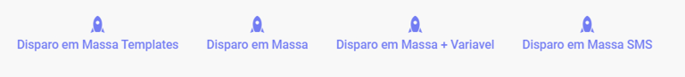
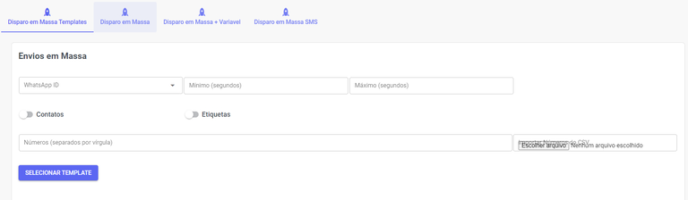
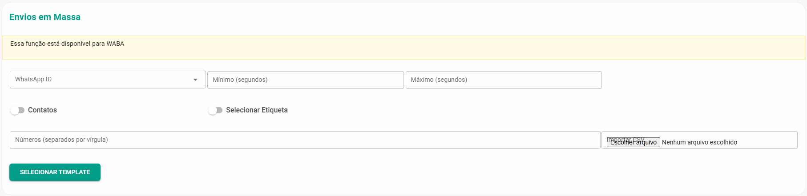
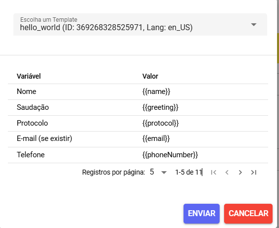
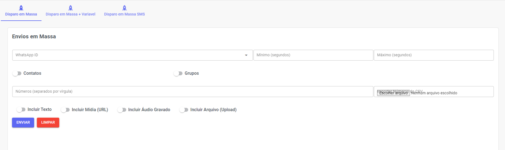
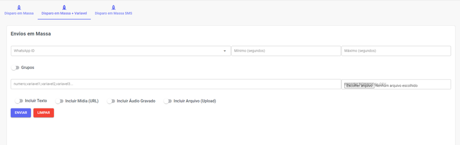
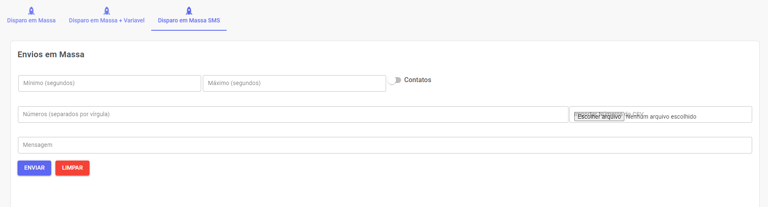
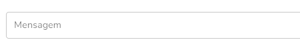

# Envio de Mensagens Massivas

Essa ferramenta permite que você faça disparos de WhatsApp diretamente na plataforma, melhorando o alcance das suas campanhas.





Você poderá realizar o disparo em massa com ou sem variáveis (API Não Oficial) ou de templates pré-aprovados na Meta (API Oficial).

## Disparo em Massa - Templates

:::tip dica
Envio de mensangens rápidas para a API Oficial (WABA)
:::

Aqui você pode configurar e enviar mensagens rápidas e em massa via API Oficial.



### Campos de Preenchimento

| Campo | Descrição |
| :--- | :--- |
| WhatsApp ID | Se houver mais de um canal conectado, escolha **qual deles** será usado para realizar o disparo das mensagens. |
| Mínimo (segundos) | Escolha o **mínimo** de duração (intervalo de tempo) que o disparo terá. |
| Máximo (segundos) | Escolha o **máximo** de duração (intervalo de tempo) que o disparo terá. |
| Números (separados por vírgula) | Insira manualmente os números que receberão o disparo, separando-os por vírgula. |
| Importar Números do CSV | Caso não queira inserir os números manualmente, selecione um arquivo **Excel** (CSV) contendo os números desejados. |
| Ao acionar essa opção, você pode selecionar os contatos já cadastrados no sistema. |  |
| Ao selecionar essa opção, o disparo será enviado para os contatos pertencentes a essa etiqueta.  |  |

Ao final, clique em **Selecionar template**, escolha o template (podendo usar variáveis do sistema) e execute o disparo de WhatsApp!



## Disparo em Massa - Sem Variáveis

:::tip dica
Envio de mensangens rápidas para a as APIs não oficiais (Baileys e Whatsapp-Web.JS)
:::

Aqui você pode configurar e enviar mensagens rápidas e em massa via APIs não Oficiais.



### Campos de Preenchimento

| Campo | Descrição |
| :--- | :--- |
| WhatsApp ID | Se houver mais de um canal conectado, escolha **qual deles** será usado para realizar o disparo das mensagens. |
| Mínimo (segundos) | Escolha o **mínimo** de duração (intervalo de tempo) que o disparo terá. |
| Máximo (segundos) | Escolha o **máximo** de duração (intervalo de tempo) que o disparo terá. |
| Números (separados por vírgula) | Insira manualmente os números que receberão o disparo. No caso dos grupos, você deverá informar a **id** do **grupo** que podem ser extraídos de forma rápida na sessão [Grupos](grupos.md). |
| Importar Números do CSV | Caso não queira inserir os números manualmente, selecione um arquivo **Excel** (CSV) contendo os números desejados. |
| Ao acionar essa opção, você pode selecionar os contatos já cadastrados no sistema. |  |
| Ao selecionar essa opção, o disparo será enviado para os contatos pertencentes a essa etiqueta.  |  |
| Ao selecionar essa opção, o disparo será enviado para os grupos de WhatsApp em que seu número está presente. |  |
| Ao selecionar essa opção, você selecionará os card do Kanban, e quem estiver no quadro irá receber a mensagem.|  |

## Disparo em Massa - Com Variáveis

Aqui você pode configurar e enviar mensagens rápidas e em massa via APIs não oficiais podendo utilizar variáveis.



Para usar as variáveis você deverá incluí-las separadas por virgula no campo de preenchimento do números:

:::info exemplo

```
Por exemplo: Olá, {{var1}}! Seu estado é {{var2}} e sua idade é {{var3}}...
```
:::


### Campos de Preenchimento 

| Campo | Descrição |
| :--- | :--- |
| WhatsApp ID | Se houver mais de um canal conectado, escolha **qual deles** será usado para realizar o disparo das mensagens. |
| Mínimo (segundos) | Escolha o **mínimo** de duração (intervalo de tempo) que o disparo terá. |
| Máximo (segundos) | Escolha o **máximo** de duração (intervalo de tempo) que o disparo terá. |
| Números (separados por vírgula) | Insira manualmente os números que receberão o disparo. No caso dos grupos, você deverá informar a **id** do **grupo** que podem ser extraídos de forma rápida na sessão [Grupos](grupos.md). |
| Importar Números do CSV | Caso não queira inserir os números manualmente, selecione um arquivo **Excel** (CSV) contendo os números desejados. |
| Ao selecionar essa opção, o disparo será enviado para os grupos de WhatsApp em que seu número está presente. |  |


## SMS

Você pode enviar mensagens SMS em massa.



| Campo | Descrição |
| :--- | :--- |
| Mínimo (segundos) | Escolha o **mínimo** de duração (intervalo de tempo) que o disparo terá. |
| Máximo (segundos) | Escolha o **máximo** de duração (intervalo de tempo) que o disparo terá. |
| Números (separados por vírgula) | Insira manualmente os números que receberão o disparo.  |
| Importar Números do CSV | Caso não queira inserir os números manualmente, selecione um arquivo **Excel** (CSV) contendo os números desejados. |
| Ao acionar essa opção, você pode selecionar os contatos já cadastrados no sistema. |  |
|Incluir mensagem que será enviada | | 