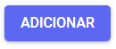
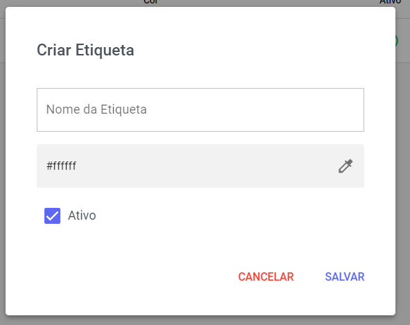
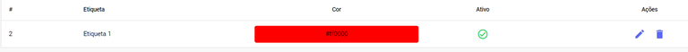

# Etiquetas 

As etiquetas são um recurso que facilita a classificação de atendimentos e contatos. Com elas, você pode criar quantas forem necessárias para organizar e identificar visualmente cada interação.

## Nova Etiqueta

Caso queira adicionar uma nova etiqueta, basta clicar no botão indicado.

Ao selecionar este botão, uma janela pop-up será exibida. Nela, você deverá preencher os campos necessários com as informações da etiqueta.

| Campo | Descrição |
| :--- | :--- |
| **Nome da Etiqueta** | Insira um nome para identificar essa Etiqueta. Lembre-se que esse nome será visto pelos Usuários no momento de classificar o atendimento/contato. |
| **Cor** | Cole um código HEX de cor ou clique no conta gotas para escolher uma cor predefinida, um código RGB ou criar a cor a partir do modelo HEX. |

## Gerenciar Etiquetas

Na parte inferior do painel de Etiquetas, você encontrará uma seção de resumo. Ela exibe informações essenciais para uma visão rápida, incluindo o **Nome** **da** **Etiqueta**, a **Cor** atribuída para identificação visual, e o **Status** atual (por exemplo, ativa ou inativa).

Em Ações, você tem duas opções: Editar as informações da etiqueta ou Excluí-la.

