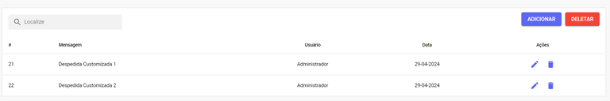
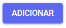
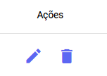

# Mensagem de Fechamento

Nesta seção, você pode configurar as mensagens de **despedida** que serão enviadas automaticamente ao **finalizar** um atendimento com o cliente.

## Nova Mensagem de Fechamento

Para adicionar uma nova mensagem de **despedida**, clique no botão **Adicionar**. Em seguida, escreva sua mensagem e finalize o cadastro clicando em **Salvar**.

## Gerenciar Despedidas

Na parte inferior da seção Fechamentos, você pode visualizar um histórico detalhado que inclui a **Mensagem** de despedida, o **Usuário** que a configurou e a **Data** da sua criação ou última edição.

Além de poder editar ou apagar as mensagens na coluna de **Ações**

