# Gestão de Grupos em Massa

Nessa seção você pode gerenciar e manipular algumas funcionalidades de grupos de forma massiva.

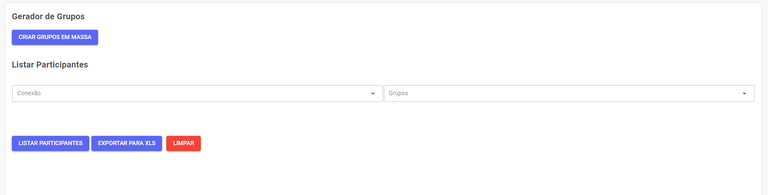

## Grupos e Participantes

Aqui você pode gerenciar grupos em massa e listar participantes.

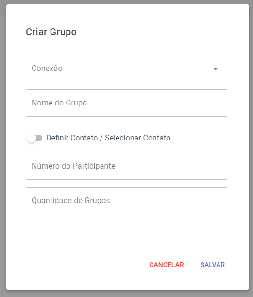

### Gerador de Grupos

Clique no botão Criar Grupos em Massa, no canto esquerdo da tela.

Assim que selecionar esse botão, um pop up se abrirá para que você preencha as informações. Veja o exemplo:

| Campo | Descrição |
| :--- | :--- |
| Conexão | Caso haja mais de um canal conectado, você escolherá um deles para esse grupo. Lembre-se que o número correspondente estará no grupo como Administrador. |
| Nome do Grupo  | Selecione como esse grupo se chamará, para visualização dos contatos adicionados. |
| Número do Participante | Adicione o primeiro participante. Nas próximas configurações você pode dar permissão de Administrador para esse primeiro participante. Recomendaos que seja um funcionário da empresa. |
| Quantidade de Grupos | Digite um número correspondente a quantidade de grupos que serão criados com essas configurações. |

Além disso, há o botão de Definir Contato / Selecionar Contato. Com essa opção acionada, você pode adicionar contatos já previamente cadastrados na sua plataforma. Ao final, clique em Salvar para finalizar o cadastro do grupo e pronto!

### Listar Id de Grupos

No campo Conexão, caso haja mais de um canal conectado, você escolherá um deles para visualizar as informações.

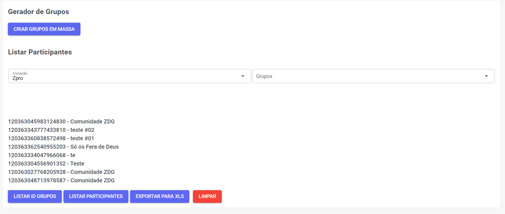

Ao final, clique em Listar ID GRUPOS, para ter acesso as ids dos grupos.

### Listar Participantes

No campo Conexão, caso haja mais de um canal conectado, você escolherá um deles para visualizar as informações.

Assim que selecionado, o campo de Grupos será desbloqueado e a lista de todos os grupos criados na plataforma irá aparecer. Veja o exemplo:

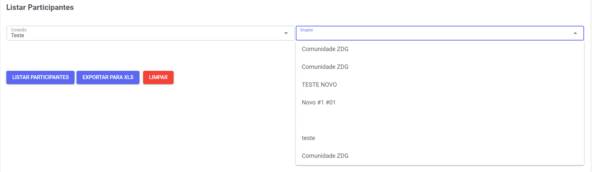

Ao final, clique em Listar Participantes, para ver quais são os números que estão no grupo selecionado.

## Manipular Grupos

Aqui você pode alterar dados dos grupos em massa.

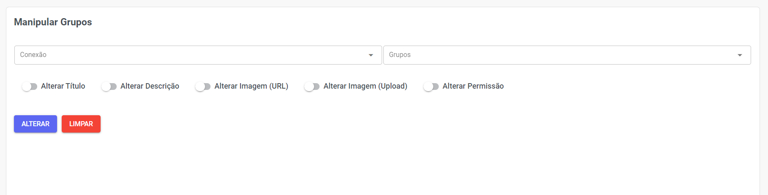

Assim como na aba anterior, aqui você encontra os campos Conexão e Grupos. Selecione o canal desejado e o grupo que deseja manipular.

Assim que os campos estiverem preenchidos, você você poderá utilizar os seguintes botões:

| Campo | Descrição |
| :--- | :--- |
| Ao acionar essa opção, se abrirá um campo para preenchimento do novo nome. |  |
| Ao selecionar essa opção, aparecerá um campo para adicionar uma nova descrição.  |  |
| Ao acionar essa opção, se abrirá um campo para que cole a URL da assetsGupo/imagem do grupo. |  |
| Ao selecionar essa opção, aparecerá um botão para fazer upload da assetsGupo/imagem do grupo. |  |
| Ao acionar essa opção, aparecerá um botão para permitir que somente Administradores possam enviar mensagens para o grupo. |  |

Ao final, clique em Alterar, para salvar as informações alteradas.

## Manipular Usuários

Aqui você pode gerenciar usuários em massa.

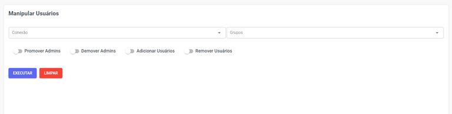

Aqui você também encontra os campos Conexão e Grupos. Novamente, selecione o canal desejado e o grupo que deseja. A diferença nesse caso, é que as ações a seguir manipularão os contatos.

Assim que os campos Conexão e Grupos estiverem preenchidos, você poderá utilizar os seguintes botões:

| Campo | Descrição |
| :--- | :--- |
| Ao selecionar essa opção, aparecerá dois novos campos: um para adicionar os números manualmente e outro para importar uma lista Excel. Os contatos adicionados aqui serão promovidos para Administradores do grupo. |  |
| Ao acionar essa opção, aparecerá dois novos campos: um para adicionar os números manualmente e outro para importar uma lista Excel. Os contatos adicionados aqui serão removidos da função Administrador.  | 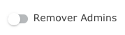 |
| Ao selecionar essa opção, aparecerá dois novos campos: um para adicionar os números manualmente e outro para importar uma lista Excel. Os contatos adicionados aqui serão incluídos no grupo. |  |
| Ao acionar essa opção, aparecerá dois novos campos: um para adicionar os números manualmente e outro para importar uma lista Excel. Os contatos adicionados aqui serão removidos do grupo. |  |

Caso qualquer uma das opções seja selecionada, aparecerá um novo botão para importar os contatos já cadastrados na plataforma. Veja o exemplo:

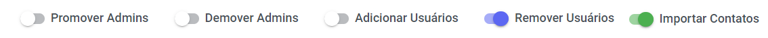

Ao final, clique em Alterar, para salvar as informações alteradas.

## Número Banidos

Aqui é onde você poderá criar uma lista de números que não serão adicionados em grupos ou receberão qualquer disparo efetuado pela sua plataforma. Assim, você evita que suas mensagens sejam denunciadas por contatos sem interesse.

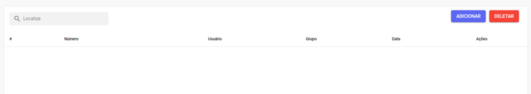

### Adicionar Número Banido

Clique no botão **Adicionar**. Assim que selecionar esse botão, um pop up se abrirá para que você preencha as informações. Veja o exemplo:

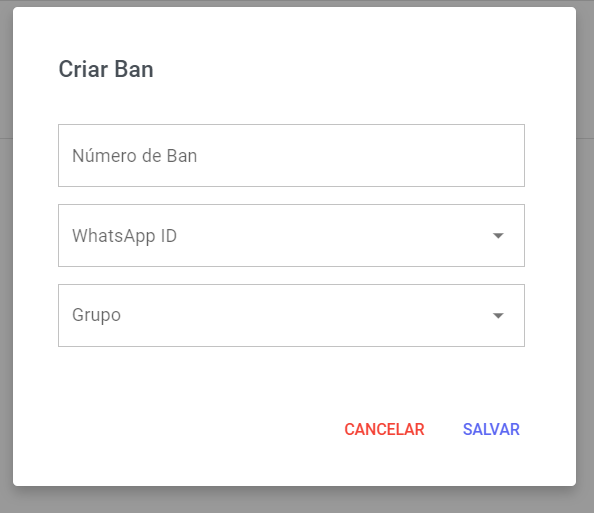

| Campo | Descrição |
| :--- | :--- |
| Número de Ban | Adicione o número que deseja banir dos disparos futuros. |
| WhatsApp ID  | Escolha qual canal deseja atribuir para esse banimento. Caso tenha dois números conectados, você pode escolher banir o contato em apenas de um deles. |
| Grupo | Aqui você pode selecionar o grupo do qual esse número será banido. |

Ao final clique em Salvar e pronto! Banimento criado com sucesso.

### Gerenciar Números Banidos

Você pode usar o campo de busca para pesquisar o contato banido. Essa função é muito útil quando há uma grande lista de banimento.

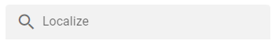

Abaixo você consegue ver informações como: número do contato banido, quem realizou o banimento, a qual grupo esse número pertencia e a data do banimento.

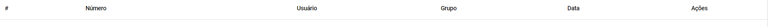

Em Ações você pode Editar as mesmas informações do cadastro do banimento ou Excluir esse ban.

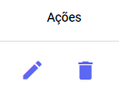

## Palavras Proibidas

Aqui você pode gerenciar e definir algumas palavars proibidas nos grupos.

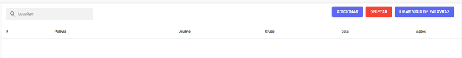

### Adicionar Palavras Proibidas

Para adicionar uma palavra proibida, clique no botão **Adicionar**. Assim que selecionar esse botão, um pop up se abrirá para que você preencha as informações. Veja o exemplo:

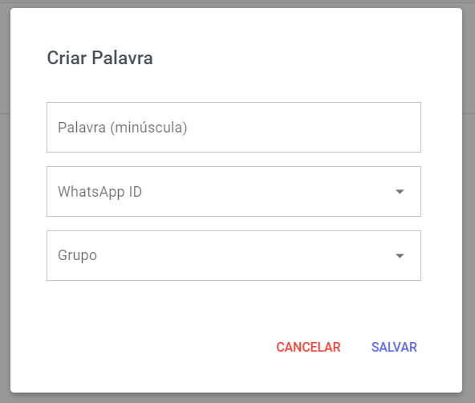

| Campo | Descrição |
| :--- | :--- |
| Palavra (minúscula) | Adicione a palavra que deseja proibir no grupo. |
| WhatsApp ID  | Escolha o **mínimo** de duração (intervalo de tempo) que o disparo terá. |
| Grupo | Aqui você pode selecionar o grupo ao qual essa mensagem será enviada. |

### Gerenciar Palavras Proibidas

Você pode usar o campo de busca para pesquisar a palavra proibida. Essa função é muito útil quando há uma grande lista de proibição.

Em Ações você pode Editar as mesmas informações do cadastro da palavra ou Excluir a mesma.

### Ligar Vigia de Palavras

Aqui você pode **ativar** a vigia das palavras proibidas. Caso você crie palavras proibidas, você deve **ativar** o vigia.

Para ligar o Vigia, clique no botão:

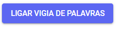

Selecione a conexão e acione o botão **Ligar/Desligar** e depois **Salve** suas mudanças.

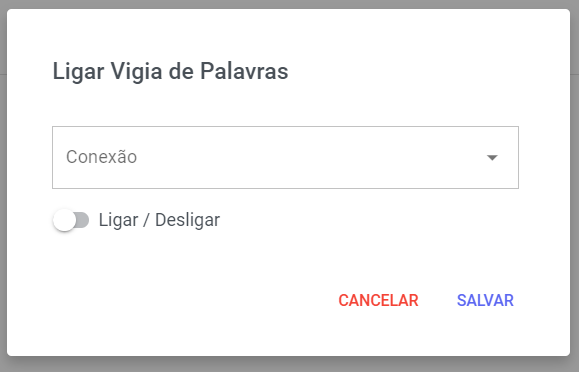

## Mensagems de Saudação

Aqui você poderá gerenciar as mensagens de saudação aos grupos.

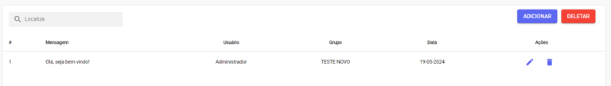

### Adicionar Saudação

Para adicionar uma saudação, clique no botão **Adicionar**. Assim que selecionar esse botão, um pop up se abrirá para que você preencha as informações. Veja o exemplo:

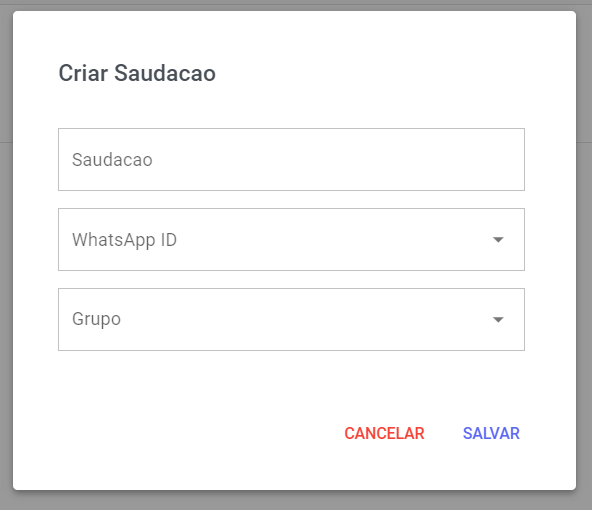

| Campo | Descrição |
| :--- | :--- |
| Saudação | Escolha qual canal deseja atribuir para essa mensagem de saudação. Caso tenha dois números conectados, você pode escolher enviar a mensagem em apenas um deles. |
| WhatsApp ID  | Escolha o **mínimo** de duração (intervalo de tempo) que o disparo terá. |
| Grupo | Aqui você pode selecionar o grupo ao qual essa mensagem será enviada. |

### Gerenciar Saudações

Você pode usar o campo de busca para pesquisar as mensagens cadastradas. Essa função é muito útil quando há um grande número de saudações.

Abaixo você consegue ver informações como: mensagem cadastrada, quem realizou esse cadastro, a qual o grupo essa saudação será enviada e a data do cadastro dessa mensagem no sistema.

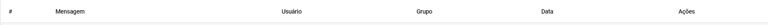

Em Ações você pode Editar as mesmas informações do cadastro da saudação ou Excluir a mesma.

## Mensagem de Despedida

Aqui nessa seção você pode gerenciar mensagens de despedidas aos grupos de forma massiva.

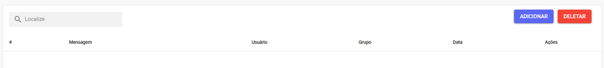

Aqui você poderá criar uma lista com mensagens de despedida que serão adicionados aos grupos correspondentes.

### Adicionar Mensagem de Despedida

Clique no botão de **Adicionar**. Assim que selecionar esse botão, um pop up se abrirá para que você preencha as informações. Veja o exemplo:

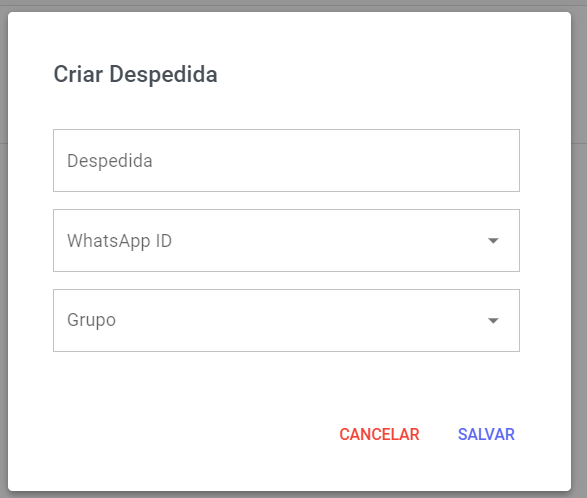

| Campo | Descrição |
| :--- | :--- |
| Despedida | Escolha qual canal deseja atribuir para essa mensagem de despedida. Caso tenha dois números conectados, você pode escolher enviar a mensagem em apenas um deles. |
| WhatsApp ID  | Escolha o **mínimo** de duração (intervalo de tempo) que o disparo terá. |
| Grupo | Aqui você pode selecionar o grupo ao qual essa mensagem será enviada. |

### Gerenciar Mensagens de Despedida 

Você pode usar o campo de busca para pesquisar as mensagens cadastradas. Essa função é muito útil quando há um grande número de mensagens de despedida.

Abaixo você consegue ver informações como: mensagem de despedida, quem realizou esse cadastro, a qual o grupo essa saudação será enviada e a data do cadastro dessa mensagem no sistema.

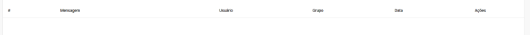

Em Ações você pode Editar as mesmas informações do cadastro da mensagem de despedida ou Excluir a mesma.

