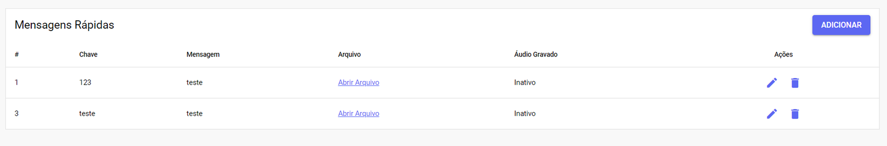
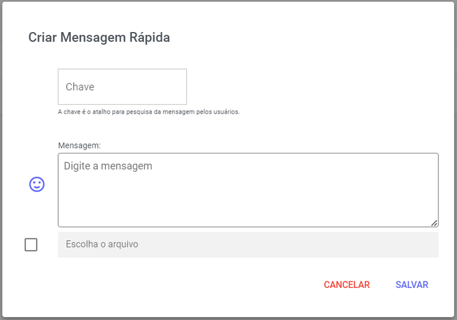
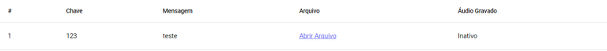
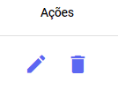

# Respostas Rápidas

Ganhe tempo e aumente a **produtividade** com as **Mensagens Rápidas.** Elas são textos predefinidos que você insere instantaneamente no **atendimento**, ideais para comunicação recorrente como: saudações iniciais, informações sobre produtos ou formulários de pesquisa.

## Nova Mensagem Rápida

Para criar uma nova mensagem rápida, clique no botão **Adicionar**. Um pop-up será exibido, permitindo que você insira todas as **informações** **necessárias** para a sua mensagem."

| Campo | Descrição |
| :--- | :--- |
| **Chave** | Insira uma **palavra-chave** para identificar a mensagem. É assim que os usuários vão buscar e usar o texto durante o atendimento. |
| **Mensagem** | Desenvolva o texto da sua mensagem. Você pode usar emojis ou outros caracteres para **facilitar a compreensão** e tornar a comunicação mais didática. |
| **Arquivo** | Utilize esta opção para **anexar arquivos** que serão enviados junto com a mensagem. |
| **Áudio Gravado** | Opção para **enviar um áudio** em vez de texto, se necessário. |

## Gerenciar Mensagens Rápidas

Na parte inferior do painel, você pode visualizar todas as suas **Mensagens Rápidas**, que exibem as seguintes informações para cada item: **Chave**, **Mensagem**, **Arquivo** e **Áudio** **Gravado**.

### Ações

Neste local, você tem as opções de **editar** a mensagem rápida existente ou **excluí-la** permanentemente.

