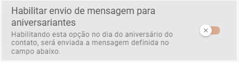
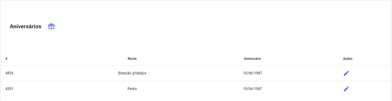
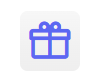

# Mensagens Agendadas de Aniversários

:::warning Aviso

Para ativar e personalizar a **Mensagem Automática de Aniversário**, você deve ativar a configuração correspondente no momento de criação do [**canal**](canal/canal.md) ou ao editar um **[canal](canal/canal.md)** já existente. Depois de ativada, você poderá escolher a mensagem que será enviada. 

:::

A Seção de **Aniversários** oferece uma listagem completa e organizada de todos os seus contatos. Você verá cada registro ordenado pelo **Nome do Contato** e sua **Data de Aniversário**. 

Para que a **Mensagem de Aniversário seja enviada** (disparada), é obrigatório que o campo **"Data de Aniversário"** seja preenchido no momento de **criação** do **contato**. Sem essa data, o envio automático da mensagem não ocorrerá.

Na coluna **Ações** você poderá editar as informações do contato.

## Disparo Manual

Caso prefira disparar as **mensagens** de aniversário **manualmente**, clique no ícone correspondente. Uma janela pop-up será aberta para que você selecione o canal desejado e, em seguida, clique em **Enviar** para realizar o disparo das mensagens dos aniversariantes do dia.

