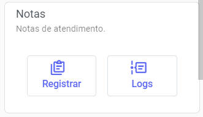
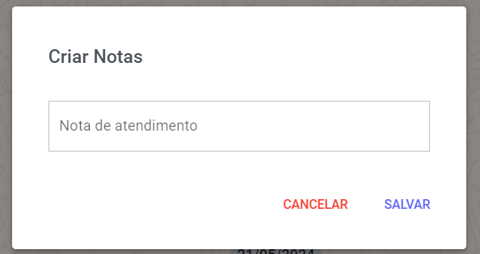
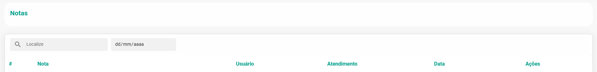
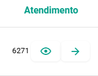
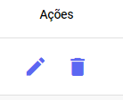

# Notas de Atendimento

Utilize este campo para registrar anotações, notas ou comentários internos exclusivos da equipe sobre o cliente. A informação é **confidencial** e restrita ao seu time, garantindo que o cliente não tenha acesso a essa nota.

Esta funcionalidade é essencial para a **gestão** **estratégica**, pois permite que a equipe:

1.  **Monitore o Comportamento do Cliente:** Registrando observações sobre o perfil e o comportamento do cliente durante a interação.
2.  **Acompanhe Negociações:** Mantendo um histórico detalhado do andamento de negociações, pendências ou próximos passos.

Ao centralizar essas notas, você garante que todos na equipe tenham contexto completo, facilitando a continuidade do serviço e **otimizando o acompanhamento** de cada ticket ou oportunidade.

## Adicionar Notas

Para registrar notas sobre o cliente, acesse primeiro o contato do cliente no painel de atendimento. No menu lateral, role até encontrar o bloco dedicado a **Notas** e clique para adicionar sua observação.

- Selecione o botão **Registrar Nota** para abrir a janela de inserção. Preencha o pop-up com a sua observação ou nota detalhada sobre o cliente e **Salve** a sua nota.
- Já em **Logs**, o usuário pode visualizar todos os registros de notas para aquele contato, organizados por ordem cronológica.

## Gerenciar Notas

Para localizar rapidamente um registro, utilize os filtros disponíveis. Você pode pesquisar pelo **texto** contido no **comentário**, pelo ID do **Ticket** correspondente ou segmentar por **data** de **criação**.

O sistema oferece um atalho para a gestão: você pode dar uma **olhada** **rápida** no status do atendimento que recebeu a nota (função **Espiar**) ou ser levado diretamente ao chat de **atendimento** com o cliente.

Na coluna **Ações** você pode:
- **Editar** o conteúdo da nota e o número do Ticket. 
- **Remover** um registro permanentemente clicando no ícone de lixeira. 

