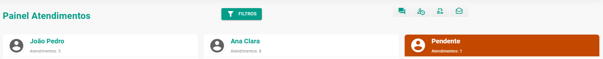
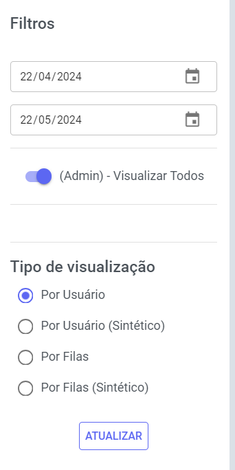

# Visão Geral dos Atendimentos

:::info dica
Apenas usuários **administradores** têm acesso a esta área. Supervisores e outros usuários estão restritos.
:::

Nesta área, você acessa um painel de **monitoramento** de **atendimentos**. Ele apresenta a quantidade de **atendimento** de cada usuário, permitindo que você avalie o desempenho da equipe de forma **rápida** e **eficiente**.

## Filtro

Você pode controlar a visualização do painel de atendimento, filtrando os dados por informações específicas que deseja analisar.

## Barra de Ferramentas

Aproveite as ferramentas de acesso rápido disponíveis nesta área para simplificar suas ações.

* **Fechar** atendimentos abertos
* **Fechar** atendimentos pendentes
* **Transferir** atendimentos para outros usuários
* **Marcar** todas as mensagens como **Lidas**