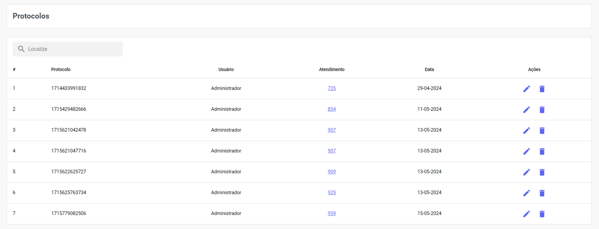
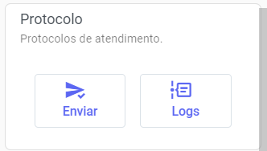
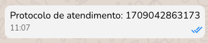
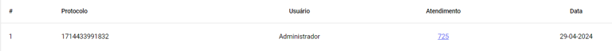
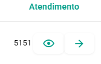

# Protocolo de Atendimento

Ao combinar este recurso com **Notas**, **Kanbans** e **Etiquetas**, você constrói um sistema robusto para o **controle** e **acompanhamento** de todos os tickets abertos por um contato. 

Além disso, utilizar os protocolos para **suporte técnico ou registro de ocorrências** transmite **profissionalismo** e **segurança** aos seus clientes, garantindo que nenhum chamado seja perdido.

## Enviar Protocolo

Os protocolos são enviados no menu lateral do painel de **atendimento**. Role o mouse até chegar ao bloco de Protocolo.

Clicando em Enviar, um número aleatório será gerado e enviado na conversa antecedido da frase: "Protocolo de atendimento".

Já em Logs, o usuário pode visualizar todos os registros de notas para aquele contato, organizados por ordem cronológica.

## Gerenciar Protocolo

Na parte inferior do painel de **Protocolos**, você pode visualizar informações como: **Número de Protocolo**, **Usuário que gerou o Protocolo**, **Número do Ticket de Atendimento** e **Data da criação do Protocolo.**

"Você pode **espiar** (monitorar em tempo real) o andamento do atendimento daquele protocolo ou **abrir** o **atendimento** diretamente para interagir com o cliente.

Em Ações, podemos **editar** ou **excluir** o **protocolo**.

