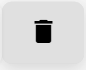

# Lista de Tarefas

As tarefas são ótimas para organizar o dia-a-dia dos usuários. Assim é possível que eles criem uma rotina de atividades, categorizando-as por prioridade, data limite, usuário responsável, etc.

## Filtros

Você pode buscar uma tarefa utilizando os seguintes critérios: nome, data limite, responsável ou descrição.

É possível filtrar por status, responsável e data limite.

## Adicionar nova tarefa

| Campo | Funcionalidade |
| :--- | :--- |
| **Nome** | Defina um título para a tarefa. |
| **Descrição** | Detalhe as informações e o que precisa ser feito na tarefa. |
| **Data Limite** | Estabeleça o prazo final para a conclusão da tarefa. |
| **Responsável** | Selecione a pessoa ou equipe encarregada de realizar a tarefa. |
| **Recorrência** | Indique se a tarefa se repete e com qual frequência. |
| **Quantidade de Repetições** | Se a tarefa for recorrente, você pode definir quantas vezes ela se repetirá. Por exemplo: "10 repetições em uma recorrência de 7 dias" significa que a tarefa será criada a cada 7 dias, até que complete 10 repetições. Após esse ciclo, a recorrência é finalizada. |
| **Status** | Altere o andamento da tarefa para atrasada, pendente ou finalizada. |
| **Prioridade** | Defina a importância ou urgência da tarefa. |
| **Comentários** | Adicione notas, observações ou informações extras sobre a tarefa. |

## Painel de tarefas

No painel de tarefas, temos algumas funcionalidades, podemos

| Nome                     | Ícones                                          |
|--------------------------|----------------------------------------------------|
| Marcar como concluída    |                              |
| Duplicar a tarefa        |                                |
| Editar a tarefa          |           |
| Excluir a tarefa         |          |
