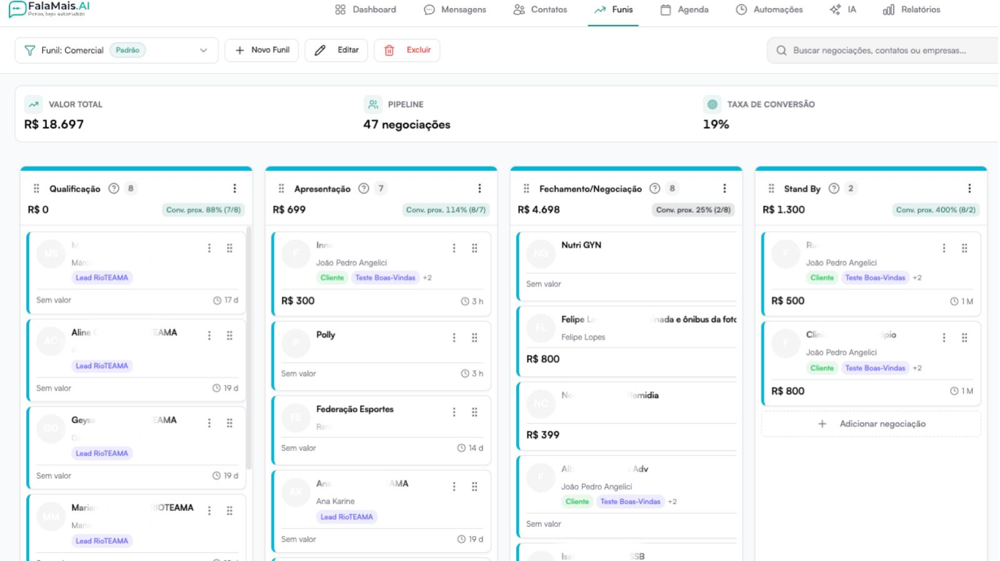
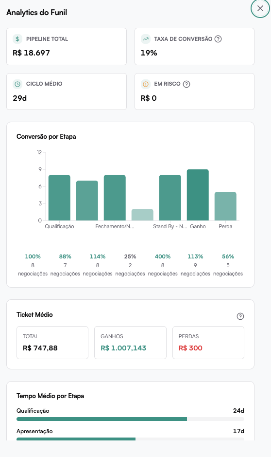

# Funil de Oportunidades

O **Funil de Oportunidades** é a área responsável por gerenciar negociações em formato visual (Kanban), organizadas por etapas do processo comercial.

Ele permite:

- Visualizar negociações por estágio
- Arrastar oportunidades entre etapas
- Acompanhar métricas do pipeline
- Criar e gerenciar múltiplos funis
- Analisar performance através de analytics

---

## Visão Geral da Interface

Na parte superior do funil são exibidos indicadores estratégicos:

- **Valor Total** → Soma das negociações ativas no funil
- **Pipeline** → Quantidade total de negociações
- **Taxa de Conversão** → Percentual de ganhos
- **Ciclo Médio** → Tempo médio até fechamento

Esses indicadores ajudam a acompanhar a saúde do processo comercial.

## Estrutura do Funil

O funil funciona como um **quadro Kanban**, onde:

- Cada coluna representa uma **etapa**
- Cada card representa uma **negociação**
- Negociações podem ser movidas por **arrastar e soltar**

Exemplos de etapas comuns:

- Trial
- Qualificação
- Apresentação
- Fechamento/Negociação
- Stand By
- Ganho
- Perda

## Criando um Novo Funil

Clique em **Novo Funil**.

###  Nome do Funil
Exemplo:
- Comercial
- Onboarding
- Projetos
- Marketing

### Cor Principal
Define a cor visual do funil e suas etapas.

### Descrição (Opcional)
Explique o objetivo do funil.

### Definir como Funil Padrão
Se ativado:
- Novos leads entram automaticamente neste funil.

Clique em **Criar Funil**.

## Alternando Entre Funis

Você pode selecionar diferentes funis no menu superior.

Exemplo:
- Comercial (Padrão)
- Onboarding
- Projetos
- Marketing

Isso permite que cada área da empresa tenha seu próprio pipeline.

## Criando uma Nova Negociação

Clique em **Nova negociação**.

### Contato (Opcional)
- Buscar contato existente
- Criar novo contato

### Título da negociação
Exemplo:
- Projeto X
- Plano Premium
- Contrato Mensal

### Participantes (Opcional)
Permite adicionar envolvidos na negociação.

### Etapa
Define em qual estágio do funil a negociação iniciará.

### Valor
Valor estimado da oportunidade.

### Data prevista
Data esperada de fechamento.

Clique em **Criar negociação**.

## Gerenciando Negociações

Cada card contém:

- Nome da empresa ou contato
- Responsável
- Valor
- Tempo na etapa
- Tags (se houver)

Você pode:

- Arrastar para mudar de etapa
- Clicar para abrir detalhes
- Editar informações
- Excluir negociação

## Detalhes da Negociação

Ao abrir uma negociação você pode editar:

- Status (Aberto, Ganho, Perdido)
- Título
- Valor
- Data prevista
- Prioridade
- Responsável
- Etapa

Também é possível:

- Vincular ou trocar contato
- Adicionar participantes
- Salvar alterações
- Excluir negociação

## Filtros do Funil

Clique em **Filtros** para refinar visualização.

Você pode filtrar por:

- Status
- Responsável
- Atividade
- Tags

Também é possível limpar todos os filtros.

## Analytics do Funil

Clique em **Analytics** para abrir as métricas detalhadas.

### Indicadores Principais

- **Pipeline Total**
- **Taxa de Conversão**
- **Ciclo Médio**
- **Em Risco**

### Conversão por Etapa

Mostra:

- Quantidade de negociações
- Percentual de conversão por estágio

Ajuda a identificar gargalos no processo.

### Ticket Médio

Exibe:

- Valor médio total
- Média dos ganhos
- Média das perdas

Permite analisar qualidade das oportunidades.

### Tempo Médio por Etapa

Mostra quanto tempo, em média, negociações permanecem em cada estágio.

Permite identificar:
- Etapas demoradas
- Travamentos no processo

### Motivos de Perda

Lista principais razões de perda.

Exemplos:
- Lead desqualificado
- Não precisavam no momento

Ajuda na melhoria da qualificação.

### Top 5 Negociações

Exibe as negociações com maior destaque (geralmente por valor ou impacto).

Permite visualizar rapidamente oportunidades estratégicas.

## Status da Negociação

As negociações podem ser marcadas como:

- Ganho
- Perdido

Negociações ganhas e perdidas impactam diretamente:

- Taxa de conversão
- Ticket médio
- Ciclo médio
- Métricas gerais do funil
