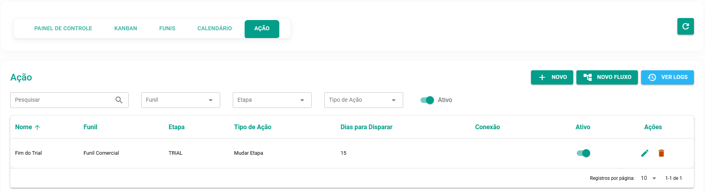
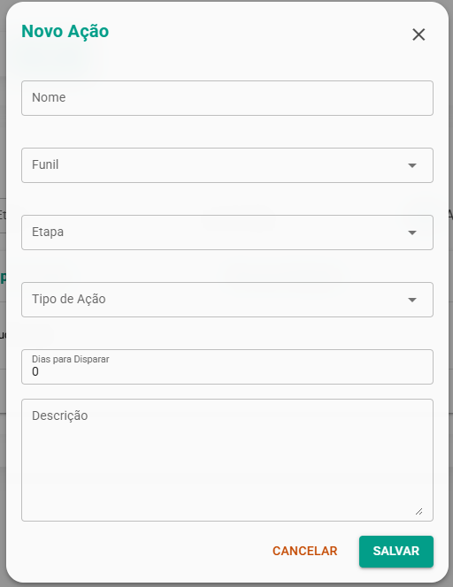
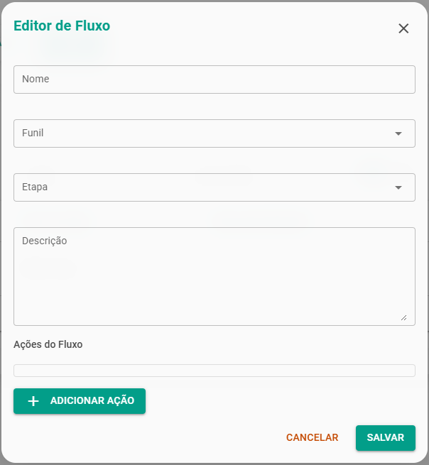

# Automatizando seu Funil com Ações e Fluxos

:::warning aviso
Regra 1: O Cálculo de Tempo é Baseado na DATA DE CRIAÇÃO da Oportunidade

Quando você define que uma ação ocorrerá em "2 dias", significa dois dias após a oportunidade ter sido criada, e não dois dias após ela ter entrado na etapa atual.

:::

* A Regra da "Mudança de Etapa"
  * Ao configurar múltiplas ações para o mesmo dia, a ação de "Mudar de Etapa" deve ser sempre a última a ser executada.

## Botões Principais:

* **+ NOVO**: Para adicionar uma **Ação** individual e pontual.
* **Novo Fluxo**: Para criar um **agrupador** que conterá uma sequência de ações.
* **Ver Logs**: Para visualizar o histórico de todas as ações executadas.

Além das colunas, a tabela exibe os botões **Editar** ou **Excluir** para gerenciamento de cada item.

:::tip Dica
* Utilize as **Ações Simples** para tarefas isoladas e os **Fluxos** para sequências de comunicação ou gestão que exigem múltiplos passos e timings definidos.
* Na coluna "Tipo de Ação", o item será identificado como "**Fluxo**" se for um agrupador, ou pelo tipo específico (ex: "Enviar Mensagem") se for uma ação individual.
:::

## Ações (Ações Simples)

Uma Ação é uma automação única configurada para ser disparada quando uma oportunidade atende a uma condição (geralmente, entrar ou permanecer em uma Etapa específica do Funil).

Você define o gatilho (**Funil e Etapa**) e o tipo de ação a ser executada:

* **Envio de Mensagem:** Envie automaticamente mensagens (ex: via WhatsApp) para o contato atrelado à negociação. Útil para alertas de produto pronto, solicitações de feedback ou lembretes.
* **Mudança de Etapa:** Mova a oportunidade para a próxima etapa. Isso pode ser configurado para ocorrer após um intervalo de tempo definido (ex: 15 dias após o início de um trial, o negócio muda automaticamente para "Implementação").
* **Mudança de Status:** Altere automaticamente o status da negociação para "Ganho" ou "Perdido" ao atingir uma etapa específica (ex: ao entrar na etapa "Fechamento", o status muda para "Ganho").
* **Adicionar Etiqueta** (Tag): Aplique uma etiqueta à oportunidade ou ao contato para auxiliar na segmentação e em outras automações.
* **Adicionar à Carteira:** Atribua a negociação à carteira de um vendedor ou atendimento específico.

| Coluna | Descrição |
| :--- | :--- |
| **Nome** | Nome definido para a Ação ou Fluxo. |
| **Funil** | Funil ao qual a automação está vinculada. |
| **Etapa** | Etapa específica que dispara a automação. |
| **Tipo de Ação** | Ação específica configurada (ex: Enviar Mensagem, Mudança de Etapa) ou **Fluxo** se for um agrupador. |
| **Dias para Disparar** | Intervalo de tempo (em dias) após o gatilho da etapa para a ação ser executada (0 dias = Imediatamente). |
| **Conexão** | Indica o canal utilizado (ex: WhatsApp, E-mail) |
| **Ativo** | Status da automação (Ligado/Desligado). |

## Fluxo (Sequência de Ações)

Um Fluxo nada mais é do que uma sequência de Ações. Ele permite que você encadeie múltiplas automações em diferentes momentos, criando campanhas de follow-up sofisticadas.

**Como Funciona:**

* A oportunidade entra na Etapa definida (o gatilho).
* O Fluxo executa a primeira ação (ex: envia uma mensagem imediatamente).
* O Fluxo agenda as ações subsequentes com base em intervalos de tempo (ex: envia uma segunda mensagem de feedback 3 dias depois).
* O Fluxo finaliza com uma ação de gestão (ex: muda a oportunidade para a etapa "Finalizados").

| Coluna | Descrição |
| :--- | :--- |
| **Nome** | Nome definido para a Ação ou Fluxo. |
| **Funil** | Funil ao qual a automação está vinculada. |
| **Etapa** | Etapa específica que dispara a automação. |
| **Tipo de Ação** | Ação específica configurada (ex: Enviar Mensagem, Mudança de Etapa) ou **Fluxo** se for um agrupador. |
| **Dias para Disparar** | Intervalo de tempo (em dias) após o gatilho da etapa para a ação ser executada (0 dias = Imediatamente). |
| **Conexão** | Indica o canal utilizado (ex: WhatsApp, E-mail) |
| **Ativo** | Status da automação (Ligado/Desligado). |

:::tip dica
**Benefício**: O uso de Fluxos garante que o seu processo de follow-up seja completo e pontual, eliminando a chance de esquecimento e mantendo o cliente engajado ao longo do funil.
:::

## Verificando Logs de Execução

Para auditar e verificar se suas automações estão sendo executadas corretamente, utilize os logs.

1. Clique no botão Ver Logs.
2. Uma tela exibirá o histórico de todas as ações, com as seguintes informações: `Data` da execução, `Oportunidade, Contato, Número, Email, Ação executada` e o ``Status`` ("success" se foi realizada com sucesso).

:::warning Atenção aos seguintes pontos:

- Ao criar uma **Ação**, os "Tipos de Ação" chamados "Fluxo" e "Funil" atualmente não possuem funcionalidade e não devem ser utilizados.
- Ao criar um **Novo Fluxo**, o nome inicial pode ser sobrescrito pelo nome da primeira ação criada. Após a criação, você pode clicar em editar e renomear o fluxo para o nome que desejar.
:::

