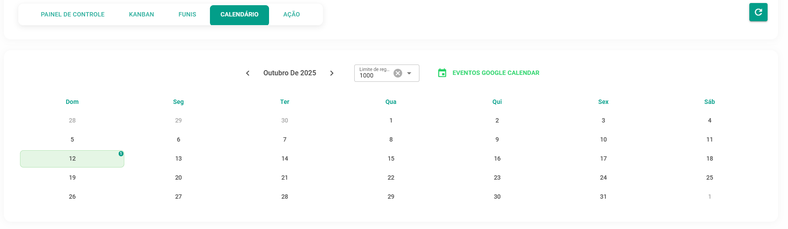

# Calendário: A Visão Temporal

Esta é a sua **visão** **temporal**. O Calendário exibe as oportunidades e suas tarefas associadas com base em suas datas de fechamento previstas ou prazos. É útil para planejar suas atividades e *follow-ups*.

**Ação Principal:** Clique em um dia específico no calendário para listar as oportunidades com vencimento naquela data ou para adicionar novas.

Ao clicar no dia, você poderá listar as oportunidades ou adicionar novas:

Para maximizar a sua produtividade, a plataforma oferece uma integração completa e bidirecional com o Google Calendar:

* **Visualização Unificada**: A sincronização permite que você tenha uma visão consolidada, trazendo eventos do Google Calendar para a sua plataforma e vice-versa.
* **Criação de Eventos Simplificada**: Ao criar uma negociação ou marcar uma reunião com um cliente dentro do sistema, você pode criar o evento correspondente no Google Calendar em um clique. Isso garante que você seja lembrado e possa trabalhar o follow-up dentro do seu fluxo normal de agenda.
* **Fluxo de Trabalho Centralizado**: Você consegue trazer os dados das suas negociações para o Google Calendar, ou trazer eventos do Google Calendar para o funil, garantindo que todas as suas atividades estejam alinhadas sem a necessidade de alternar constantemente entre ferramentas.