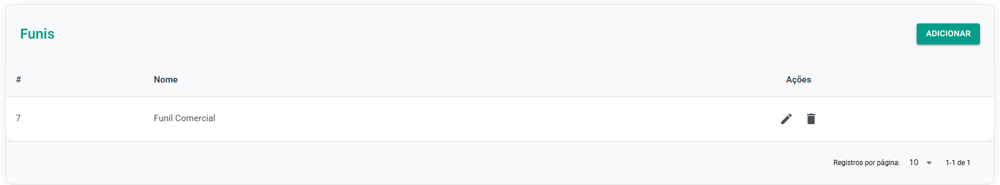

# Funis

A área de criação e gestão de funis é onde você define a estrutura do seu processo **comercial**, **estabelecendo** as etapas que uma negociação deve seguir. É possível criar **múltiplos** funis para diferentes produtos, equipes ou objetivos (ex: Funil Comercial, Funil de Pós-Venda, Funil de Lançamento).

## Criação de um Novo Funil

* **Adicionar**: Clique na opção "**Adicionar**" para iniciar a criação de um novo funil.
* **Nomear** **o Funil**: Defina um nome claro e objetivo que represente o processo que este funil irá gerenciar (Exemplo: Funil do Produto X).
* **Definir** **as Etapas** (Fases): Adicione as etapas que compõem o seu ciclo de vendas, na ordem em que elas devem ocorrer. Essas etapas representam o status atual da negociação.
  * Exemplos de Etapas: Qualificação, Proposta, Apresentação, Negociação, Fechamento, Implementação.
* **Personalizar** (Opcional):
  * É possível mudar as cores de cada etapa, o que pode auxiliar na visualização rápida e na identificação das fases pela equipe.
  * Você pode adicionar, excluir ou renomear as etapas a qualquer momento para adaptar o funil à evolução do seu processo.
* **Salvar**: Após definir todas as etapas, salve o funil. Ele estará pronto para receber as negociações.

## Gerenciamento de um Funil

Na área de Gestão de Funis, você tem acesso à **listagem** completa de todos os funis criados. A partir desta visualização, é possível **editar** as **configurações** de um funil específico ou **excluí-lo permanentemente.**