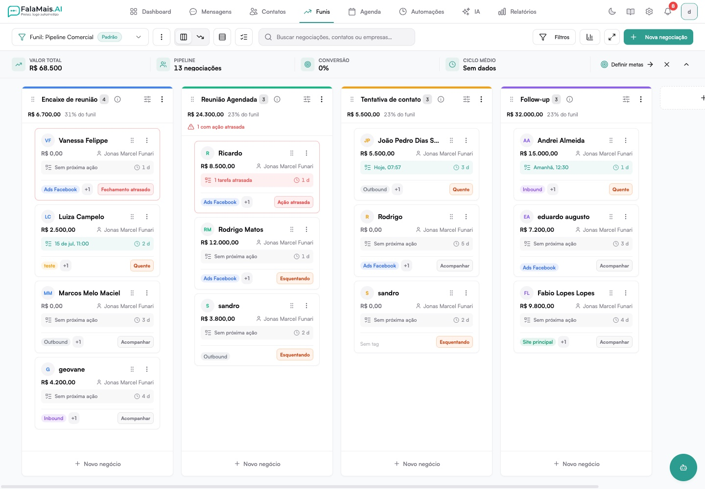
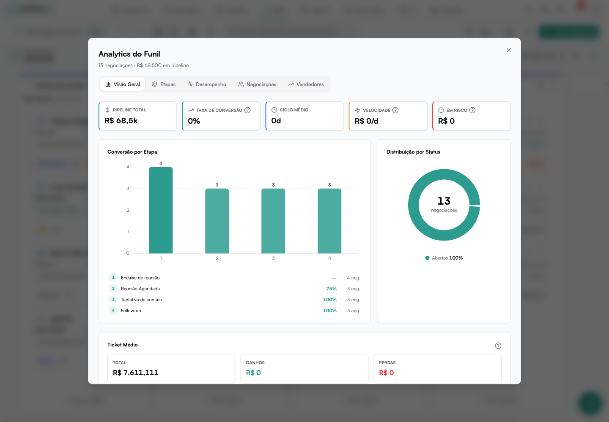

# Funil 

O **Funil de Oportunidades** é a área responsável por gerenciar negociações em formato visual (Kanban), organizadas por etapas do processo comercial.

Ele permite:

- Visualizar negociações por estágio
- Arrastar oportunidades entre etapas
- Acompanhar métricas do pipeline
- Criar e gerenciar múltiplos funis
- Analisar performance através de analytics

---

## Visão Geral da Interface

Na parte superior, o cabeçalho concentra a troca de funil, busca, filtros,
visualização e ações. Logo abaixo ficam os indicadores estratégicos:

- **Valor Total** → Soma das negociações ativas no funil
- **Pipeline** → Quantidade total de negociações
- **Taxa de Conversão** → Percentual de ganhos
- **Ciclo Médio** → Tempo médio até fechamento

Esses indicadores ajudam a acompanhar a saúde do processo comercial.

Em desktop, a faixa de métricas pode ser recolhida. O resumo compacto mantém os
valores principais visíveis e libera mais espaço para o quadro. A preferência
fica salva para os próximos acessos.

## Estrutura do Funil

O funil funciona como um **quadro Kanban**, onde:

- Cada coluna representa uma **etapa**
- Cada card representa uma **negociação**
- Negociações podem ser movidas por **arrastar e soltar**

Cada card prioriza:

- título da negociação
- contato ou empresa
- valor e responsável
- próxima tarefa ou ação prevista
- prazo vencido ou outro sinal que exige atenção
- tags essenciais

Títulos longos são cortados sem aumentar a altura do card. Assim, as colunas
permanecem alinhadas e mais fáceis de comparar.

Exemplos de etapas comuns:

- Trial
- Qualificação
- Apresentação
- Fechamento/Negociação
- Stand By
- Ganho
- Perda

## Criando um Novo Funil

Clique em **Novo Funil** no menu superior.

###  Nome do Funil
Exemplo:
- Comercial
- Onboarding
- Projetos
- Marketing

### Cor Principal
Define a cor visual do funil e suas etapas.

### Descrição (Opcional)
Explique o objetivo do funil.

### Definir como Funil Padrão
Se ativado:
- Novos leads entram automaticamente neste funil.

Clique em **Criar Funil**.

## Alternando Entre Funis

Você pode selecionar diferentes funis no menu superior.

Exemplo:
- Comercial (Padrão)
- Onboarding
- Projetos
- Marketing

Isso permite que cada área da empresa tenha seu próprio pipeline.

## Criando uma Nova Etapa

No funil, clique em **Adicionar Etapa** (disponível ao final das colunas existentes).

### Campos disponíveis

- **Nome** → Nome da etapa (ex: Qualificado, Proposta Enviada)
- **Descrição (opcional)** → Explique o critério de entrada nesta etapa (ex: Budget e decisor confirmados)
- **Cor** → Cor visual da etapa no Kanban

### Etapa ganha / Etapa perdida

Dois toggles permitem definir se esta etapa representa um desfecho:

- **Etapa ganha** → Negociações nesta etapa contam como ganhas nas métricas
- **Etapa perdida** → Negociações nesta etapa contam como perdidas nas métricas

Clique em **Criar etapa**.

---

## Criando uma Nova Negociação

Clique em **Nova negociação**.

### Contato (Opcional)
- Buscar contato existente
- Criar novo contato

### Título da negociação
Exemplo:
- Projeto X
- Plano Premium
- Contrato Mensal

### Participantes (Opcional)
Permite adicionar envolvidos na negociação.

### Etapa
Define em qual estágio do funil a negociação iniciará.

### Valor
Valor estimado da oportunidade.

### Data prevista
Data esperada de fechamento.

Clique em **Criar negociação**.

## Gerenciando Negociações

Cada card contém:

- Título da negociação e contato ou empresa
- Responsável
- Valor
- Próxima ação
- Prazo ou risco operacional
- Tags principais (se houver)

Você pode:

- Arrastar para mudar de etapa
- Clicar para abrir detalhes
- Editar informações
- Excluir negociação

## Detalhes da Negociação

Ao clicar em um card, abre a tela completa da negociação. Ela é dividida em seções:

### Informações principais

- **Status** → Aberto, Ganho ou Perdido (use os botões **Ganhar** / **Perder** no topo)
- **Título**
- **Valor**
- **Data prevista**
- **Prioridade** → Sem prioridade, Baixa, Média, Alta
- **Responsável**
- **Etapa** → Pode ser alterada diretamente aqui

### Campos personalizados

Seção separada que exibe campos adicionais configurados pela equipe.  
Clique em **Configurar** para criar ou editar os campos disponíveis.

Campos do tipo **Moeda** usam máscara em reais durante a edição e mantêm o
valor numérico para filtros e importações.

### Tarefas

A seção **Tarefas** mostra as atividades ligadas à negociação. Clique em uma
tarefa para abrir os detalhes completos ou use **Nova tarefa**.

O editor permite alterar:

- título e descrição
- prioridade e responsável
- prazo e horário
- checklist
- negociação vinculada

Uma tarefa pode ser concluída diretamente pela janela. Se houver edições ainda
não salvas, o sistema salva primeiro e conclui depois. Também é possível
remover o vínculo com a negociação antes de salvar.

### Contato e Participantes

- **Ver contato** → Abre o perfil do contato vinculado
- **Criar contato** → Cria um novo contato direto da negociação
- **Trocar contato** → Substitui o contato vinculado
- **Participantes** → Adiciona outras pessoas envolvidas na negociação

### Tags do contato

Exibe as tags associadas ao contato vinculado. Útil para identificar rapidamente o perfil do lead.

### Produtos e serviços

Permite vincular produtos ou serviços à negociação.

- Clique em **Adicionar** para incluir itens
- O sistema calcula automaticamente **Subtotal** e **Total**
- É possível aplicar **desconto ou imposto** clicando em "Editar desconto / imposto"
- Quando o produto possui um desconto de referência no catálogo, o vendedor
  vê essa sugestão ao incluir o item. O valor aplicado continua editável.

Gestores podem abrir **Relatórios → Biblioteca → Desconto médio por vendedor**
para comparar o percentual concedido com a referência de cada produto. Uma
diferença positiva indica desconto acima do padrão cadastrado.

### Propostas e contratos

- **Gerar documento** → Cria um documento formal (proposta ou contrato) a partir da negociação
- **Oferta FalaMais** → Modelo de oferta comercial padrão; clique em **Criar oferta** para gerar uma nova oferta vinculada a esta negociação

### Notas e Resumo

- **Adicionar nota** → Registra observações livres sobre a negociação
- **Resumo** → Exibe um histórico resumido com datas das interações

### Logs e atividade

Seção expansível que registra todas as ações realizadas na negociação (alterações de etapa, edições, etc.).

### Anexos

Permite adicionar arquivos à negociação (contratos, propostas, planilhas).  
Clique em **Adicionar** para fazer upload.

### Excluir negociação

Na seção **Ações da negociação**, o botão **Excluir negociação** remove permanentemente o registro do funil. Use apenas quando a negociação não deve mais aparecer em nenhum funil.

## Filtros do Funil

Clique em **Filtros** para refinar visualização.

Você pode filtrar por:

- Status
- Responsável
- Atividade
- Tags
- Data de criação
- Data prevista de fechamento
- Campos personalizados

Filtros de campos personalizados respeitam o tipo configurado. Texto, número,
moeda, data e seleção oferecem operadores adequados, e regras avançadas podem
ser combinadas com **E** ou **OU**.

Também é possível limpar todos os filtros.

### Filtros e ordenação de cada etapa

Além do filtro geral, cada coluna do Kanban possui controles próprios no
cabeçalho:

- **Filtrar** → mostra somente negociações de uma prioridade ou faixa de
  temperatura naquela etapa
- **Ordenar** → permite usar a ordem manual, prioridade alta primeiro,
  negociações mais recentes primeiro ou mais antigas primeiro

Quando um filtro da etapa está ativo, ele aparece em um chip visível no
cabeçalho, como **Alta** ou **Quentes (4-5)**. Clique no **X** do chip para
remover apenas aquele filtro.

Essas escolhas ficam salvas no navegador para cada funil e etapa. Assim, ao
voltar para a página, você continua com a mesma organização. A contagem e o
valor do cabeçalho mostram o que está visível e indicam quando existe um
total maior por trás do filtro.

Quando configurados, o cabeçalho da etapa também mostra descrição, participação
no estoque e limite de trabalho em andamento. Esses elementos não reservam
espaço quando estão vazios.

## Densidade e modo de foco

Na visão Kanban, escolha entre:

- **Confortável** — mais contexto dentro do card
- **Compacta** — mais negociações visíveis ao mesmo tempo

O **Modo de foco** remove métricas e elementos secundários para dedicar a área
principal ao quadro. Densidade, modo de foco e estado das métricas ficam salvos
por empresa e funil.

## Kanban e visão Funil

Use o seletor **Kanban / Funil** para alternar entre:

- **Kanban** → colunas completas para trabalhar e mover negociações
- **Funil** → visão afunilada para comparar estoque ou conversão

O sistema lembra a última visão escolhida. Na visão Funil, etapas sem
negociações aparecem esmaecidas e identificadas com **0 negociações**. Clique
em qualquer faixa para voltar ao Kanban já posicionado na coluna escolhida.

Dentro da visão afunilada, escolha:

- **Estoque atual** — compara as negociações que estão em cada etapa agora
- **Conversão no período** — acompanha uma coorte de negociações criadas nos
  últimos 30, 90 ou 180 dias e mostra quantas alcançaram cada etapa

Quando há filtros ativos, **Estoque atual** informa quantas negociações estão
visíveis em relação ao total. A conversão usa sua própria coorte para não
apresentar percentuais artificiais quando uma etapa tem mais negociações do que
a anterior.

## Temperatura da negociação

O indicador de temperatura ajuda a priorizar as oportunidades abertas. Passe
o cursor sobre o indicador para ver os motivos considerados.

Além da atividade recente e da previsão de fechamento, a temperatura considera
as tarefas vinculadas à negociação:

- uma tarefa futura dentro do prazo ajuda a aquecer a oportunidade
- uma tarefa atrasada reduz a temperatura e sinaliza a pendência
- não ter tarefa aberta ou próximo passo com prazo também reduz a temperatura

Use esse indicador como apoio para organizar o trabalho; ele não altera o
status da negociação automaticamente.

## Meta mensal e celebração de venda

Quando a empresa configura metas de vendas, o Funil mostra o progresso pessoal
e da equipe. No celular, a mesma informação aparece em formato compacto acima
do quadro.

Se ainda não houver uma meta, administradores veem o atalho **Definir metas**.
Ele abre diretamente **Ajustes → Dados da empresa → Metas de vendas**. O
lembrete pode ser dispensado durante o mês atual.

Ao marcar uma negociação como **Ganha**, o vendedor responsável recebe a
celebração imediatamente. O efeito respeita a configuração de redução de
movimento do dispositivo e não se repete quando a atualização em tempo real
chega depois.

## Analytics do Funil

Clique em **Analytics** para abrir as métricas detalhadas.

A tela de Analytics possui 4 abas: **Visão Geral**, **Etapas**, **Desempenho** e **Negociações**.

### Indicadores Principais

Exibidos no topo da aba Visão Geral:

- **Pipeline Total** → Soma de todas as negociações ativas
- **Taxa de Conversão** → Percentual de negociações ganhas
- **Ciclo Médio** → Tempo médio (em dias) até o fechamento
- **Velocidade** → Valor médio gerado por dia (R$/dia)
- **Em Risco** → Valor de negociações com prazo vencido ou estagnadas

### Conversão por Etapa

Gráfico de barras mostrando a quantidade de negociações em cada etapa, acompanhado da tabela com:

- Nome da etapa
- Percentual de conversão
- Quantidade de negociações

Ajuda a identificar gargalos no processo.

### Distribuição por Status

Gráfico de pizza exibindo a proporção entre:

- **Abertos** → Negociações ainda em andamento
- **Ganhos** → Negociações finalizadas com sucesso
- **Perdidos** → Negociações encerradas sem conversão

### Ticket Médio

Exibe:

- Valor médio total
- Média dos ganhos
- Média das perdas

Permite analisar qualidade das oportunidades.

### Tempo Médio por Etapa

Mostra quanto tempo, em média, negociações permanecem em cada estágio.

Permite identificar:
- Etapas demoradas
- Travamentos no processo

### Motivos de Perda

Lista principais razões de perda.

Exemplos:
- Lead desqualificado
- Não precisavam no momento

Ajuda na melhoria da qualificação.

### Top 5 Negociações

Exibe as negociações com maior destaque (geralmente por valor ou impacto).

Permite visualizar rapidamente oportunidades estratégicas.

### Status da Negociação

As negociações podem ser marcadas como:

- Ganho
- Perdido

Negociações ganhas e perdidas impactam diretamente:

- Taxa de conversão
- Ticket médio
- Ciclo médio
- Métricas gerais do funil
