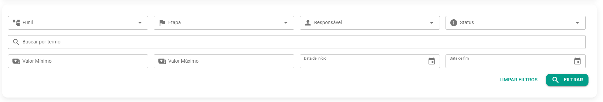
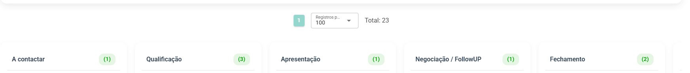

# Kanban: A Visão de Fluxo de Trabalho

Esta é a sua **visão** de fluxo de **trabalho**. O Kanban exibe suas oportunidades como "**cards**" distribuídos em colunas que representam as etapas do seu funil. É a tela ideal para o **gerenciamento** ativo do dia a dia.

:::warning aviso
Qual Kanban Utilizar?

O **FalaMais.AI** possui duas visualizações de Kanban **distintas**, cada uma com um propósito diferente:

* **Kanban de Oportunidades** (Esta Página): Utiliza as Etapas do Funil para organizar as oportunidades de negócio. É a ferramenta para a gestão de processos comerciais.
* **Kanban de Atendimentos:** Utiliza **Etiquetas** (Tags) para organizar visualmente os atendimentos em andamento. É ideal para a gestão operacional da equipe de suporte. Consulte a documentação [aqui](../kanban.md).
:::

### Filtros

Você pode personalizar a visualização dos cards no Kanban utilizando os filtros abaixo.

* **Filtro** para visualização
* **Ação Principal**: Arraste e solte (drag and drop) os cards de uma coluna para outra para atualizar o progresso de uma oportunidade de forma rápida e visual.
* **Ações Adicionais**: Dentro de um card, você pode visualizar as informações resumidas do contato e retomar o atendimento.

Nesse exemplo criamos os ***cards***:

- A contactar
- Qualificação
- Apresentação
- Negociação/FollowUP
- Fechamento

