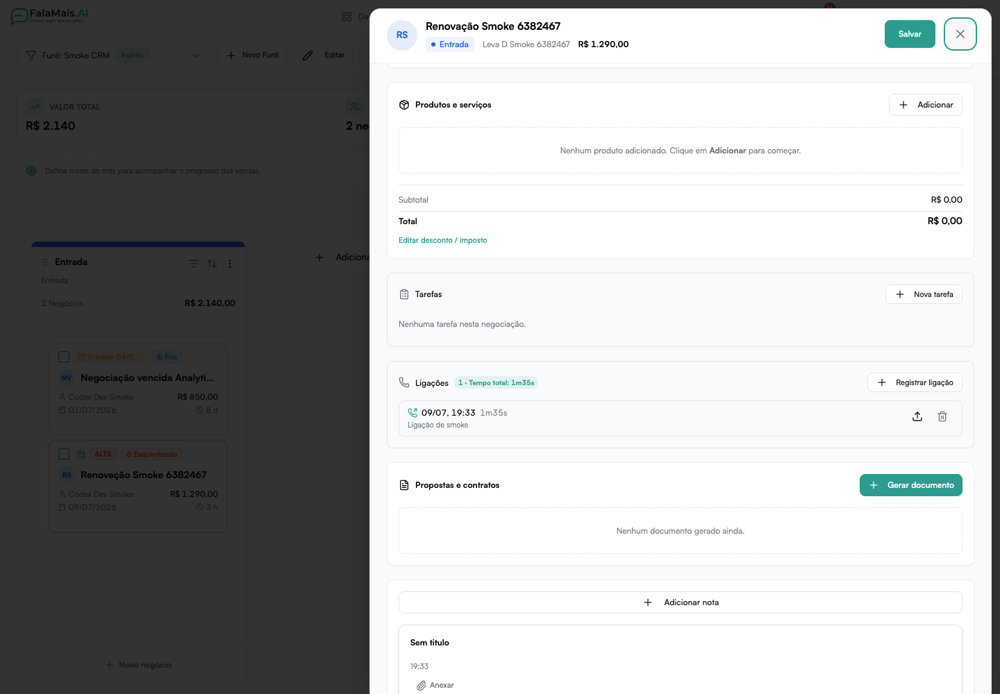

# Ligações na Negociação

Com o **registro de ligações**, sua equipe documenta cada contato por telefone
direto na negociação — quanto tempo durou, qual foi o resultado e até o áudio
da conversa.

## Registrando uma ligação

1. Abra a negociação no funil e localize a seção **Ligações**.
2. Clique em **Registrar ligação**.
3. Preencha:
   - **Data e hora** (já vêm preenchidas com o momento atual);
   - **Duração** em minutos e segundos;
   - **Direção**: realizada (você ligou) ou recebida (o cliente ligou);
   - **Resultado**: atendida, não atendida, ocupado, caixa postal, número
     errado ou retorno agendado;
   - **Observações** com o resumo da conversa.
4. Clique em **Registrar**.

Cada ligação também aparece no **histórico de atividades** da negociação.

## Anexando o áudio da chamada

Depois de registrar, use o botão de **anexar áudio** na ligação para enviar a
gravação (mp3, m4a, ogg, wav, opus e outros formatos, até 20 MB). O áudio fica
disponível com um **player embutido** — qualquer pessoa com acesso à
negociação pode ouvir sem baixar o arquivo.

## Métricas

No topo da seção, a negociação mostra o **total de ligações** e o **tempo
somado** de conversa — uma visão rápida do esforço de contato com aquele
cliente.

Em **Relatórios → Biblioteca**, o modelo **Ligações por vendedor** amplia essa
leitura para toda a equipe. Ele mostra quantidade e resultado das ligações,
tempo total e médio de conversa e o tempo de ligação acumulado antes das
conversões. O relatório também pode virar um widget de dashboard.

---

**Dica:** combine o registro de ligações com as [tarefas da negociação](../agenda.md)
para agendar o próximo retorno sempre que o resultado for "retorno agendado".
