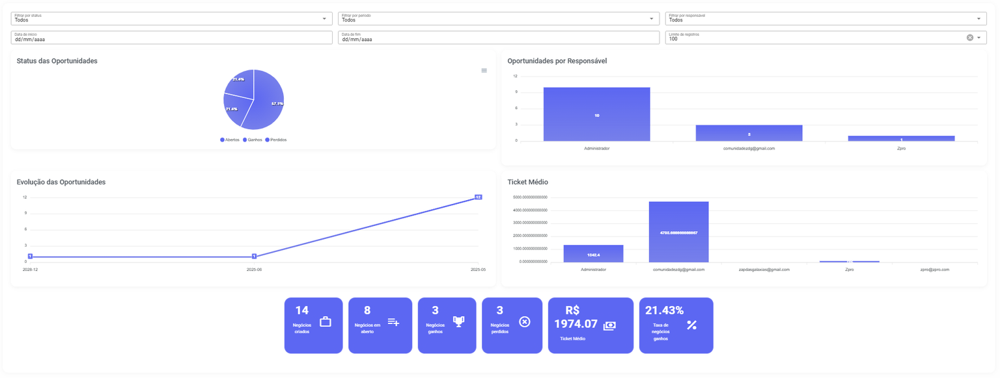

# Painel de Controle

O Painel de Controle é a sua central de inteligência estratégica. Use-o para obter uma visão macro e analítica de todas as oportunidades, permitindo que você entenda rapidamente a saúde do seu funil e a performance real da sua equipe.

Principais Componentes:

* **Filtros**: Permitem segmentar os dados por período de tempo, funil específico, etapa, status ou responsável.
* **Cards de Resumo:** Exibem os totais gerais, como o número de oportunidades abertas e o valor total em negociação.
* **Gráficos**: Mostram a distribuição visual das oportunidades por etapa do funil.
* **Lista de Oportunidades**: Uma tabela detalhada com todas as oportunidades que correspondem ao filtro aplicado.

