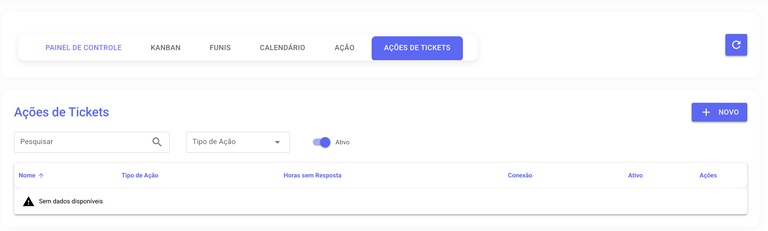
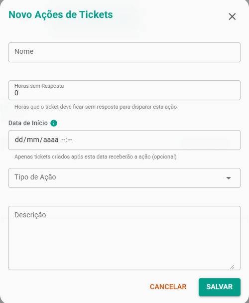
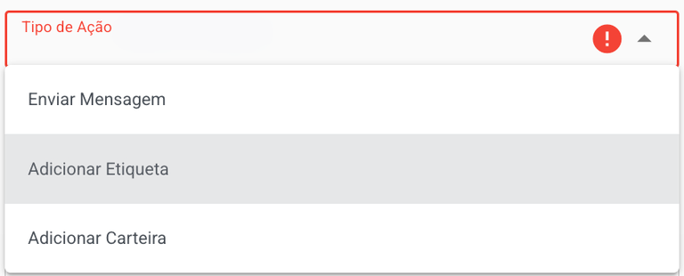
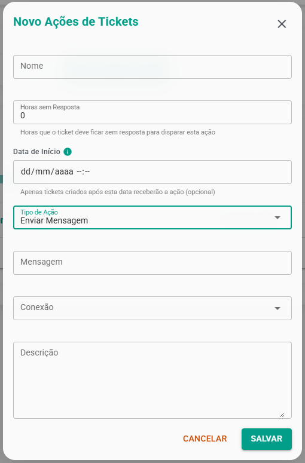
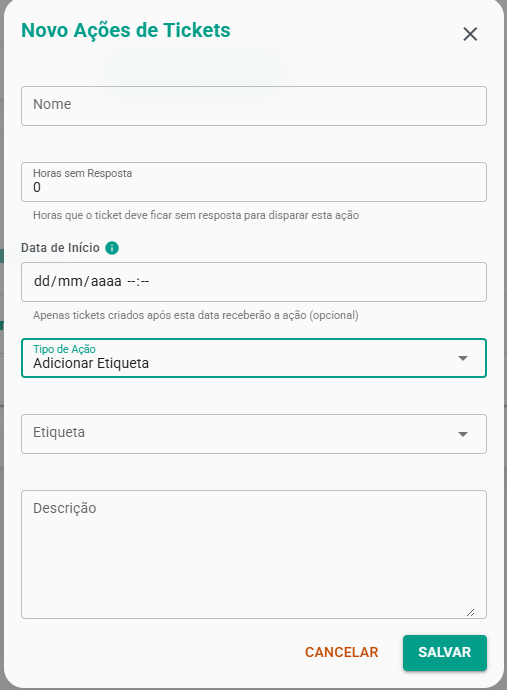
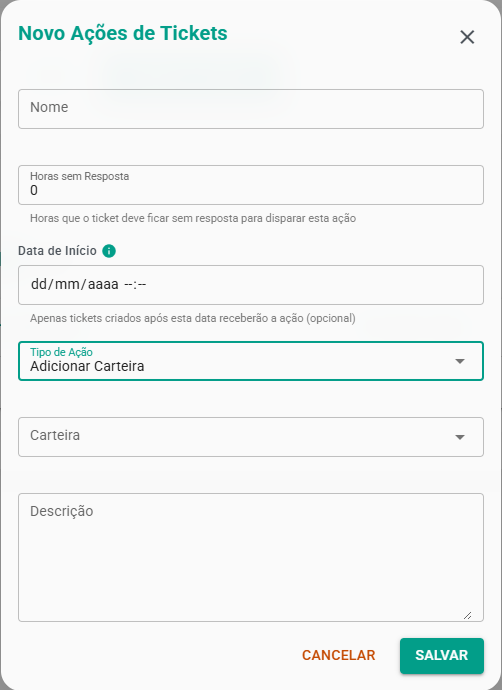

# Ações de Ticket

A funcionalidade "**Ações em Tickets**" permite criar automações de follow-up para **reengajar** clientes.

Diferente das "**Ações de Fluxo**" (que disparam quando um card é movido), estas ações são baseadas no **tempo**. Elas são disparadas quando um ticket fica um número X de horas sem resposta do cliente, desde que a última mensagem tenha sido enviada por um **atendente**.

O sistema monitora tickets nos status Aberto, Pendente e Fechado, e executa a ação que você configurar.

:::tip Lógica
Esta automação só será disparada se a **última** mensagem no ticket foi do atendente (saída do FalaMais) e o cliente não respondeu dentro do tempo estipulado. O sistema verifica esta condição em tickets Abertos, Pendentes e Fechados.
:::

## Como Configurar

Para acessar e criar as novas ações, siga os passos:

1. No menu principal, acesse **Funil**.
2. Na parte superior, clique na nova aba **Ações de tickets**.
3. Clique no botão "**Novo**" para criar uma nova regra.

## Preenchendo os Campos da Ação

Ao criar ou editar uma ação, você verá os seguintes campos:

- **Nome da ação:** Um nome para sua identificação (ex: "Follow-up 24h", "Mover para Perdido 48h").
- **Tempo (em horas):** O número de horas que o sistema deve aguardar pela resposta do cliente antes de disparar a ação.
- **Data de Início:**: Esta data define a partir de quando a ação será aplicada nos tickets. 
  - **Se preenchida**: apenas tickets após essa data receberão a ação;
  - **Se vazia**: a ação será aplicada a todos os tickets (comportamento padrão);
- **Tipo de ação:** O que deve acontecer após o tempo de espera ser atingido.
- **Descrição:** Detalhamento da ação.

## Tipos de Ações Disponíveis

Atualmente, você pode configurar as seguintes ações automáticas:

### Enviar Mensagem

- Esta ação envia uma **mensagem** de **texto** automática para o cliente, **reabrindo** o ticket se necessário.
- Como usar: Selecione a "Ação" como "**Enviar Mensagem**". Escreva o texto no **campo** "Mensagem" e escolha a "**conexão**" (canal) por onde a mensagem deve ser enviada.
- Caso de Uso: **Perfeito** para **reengajar** um cliente com uma mensagem de follow-up (ex: "Olá! Conseguiu verificar a proposta que enviei?").

### Adicionar Etiqueta

- Esta ação aplica uma etiqueta (Tag) **específica** ao contato.
- Como usar: Selecione a "Ação" como "**Adicionar Etiqueta**" e, em seguida, escolha a "**Etiqueta**" desejada no campo que aparecerá.
- Caso de Uso: Útil para **classificar** clientes **inativos**. Por exemplo, se um cliente não responde em 72 horas, o sistema pode adicionar automaticamente a etiqueta "Cliente Frio".

### Adicionar Carteira

- Esta ação atribui o contato (lead) a uma **carteira** de usuário **específica**.
- Como usar: Selecione a "Ação" como "**Adicionar Carteira**" e, em seguida, escolha o "Usuário" (atendente) que se tornará o d**ono desse contato**.
- Caso de Uso: Se um lead de prospecção não responde ao atendente atual, a ação pode movê-lo automaticamente para a carteira de um gerente ou de um especialista em recuperação.

