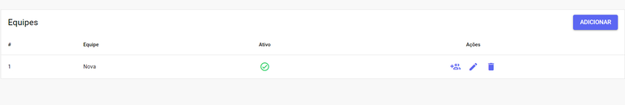
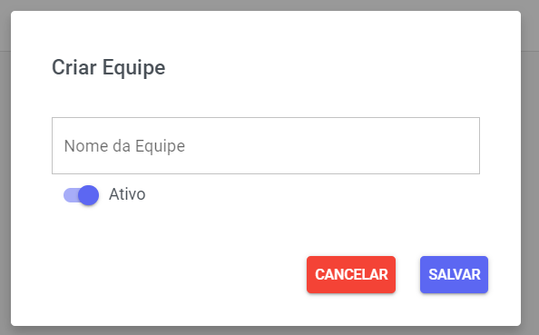
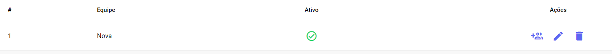

# Equipe

Esta seção permite que você **gerencie** suas equipes para organizar os **usuários** do sistema. Caso seja necessário segmentar o trabalho, você pode adicionar uma **nova** equipe e **vincular** os respectivos membros a ela.

## Nova Equipe

Para criar uma nova **equipe**, clique no botão **Adicionar**. Um pop-up aparecerá para que você dê um **nome** à equipe, defina o **status** de ativação (ativa ou inativa) e, em seguida, clique em **Salvar**.

## Gerenciar Equipes

Na coluna **Ações**, você pode gerenciar a equipe de três maneiras:

- **Gerenciar** **Usuários**: **Adicionar** ou **remover** membros da equipe.
- **Editar**: Alterar o **nome** da equipe e o **status** dela (ativo ou não).
- **Excluir**: **Apagar** a equipe permanentemente.