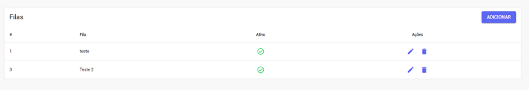
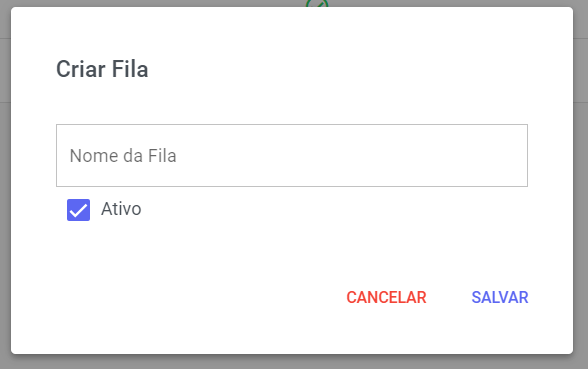

# Cadastro de Filas

As Filas de Atendimento são um componente **fundamental** para a organização **estratégica** do fluxo de trabalho. Elas funcionam como um método para **direcionar** e **distribuir** os atendimentos de entrada, separando-os de acordo com **setores** ou **departamentos** específicos da sua empresa.

## Nova Fila

Para adicionar uma nova Fila, clique no botão **Adicionar**. Um pop-up será exibido para que você preencha o nome da fila e defina o status (se deseja que ela fique ativa imediatamente ou não) e depois clique em **Salvar**.

## Gerenciar Filas

A **gestão** de filas é simples: você pode editar o **nome** e o **status** de cada **fila** (definindo se ela está ativa ou não), ou optar por **excluir** a fila definitivamente.

