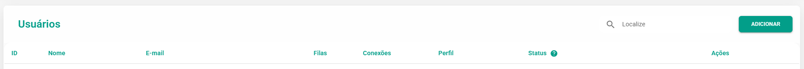
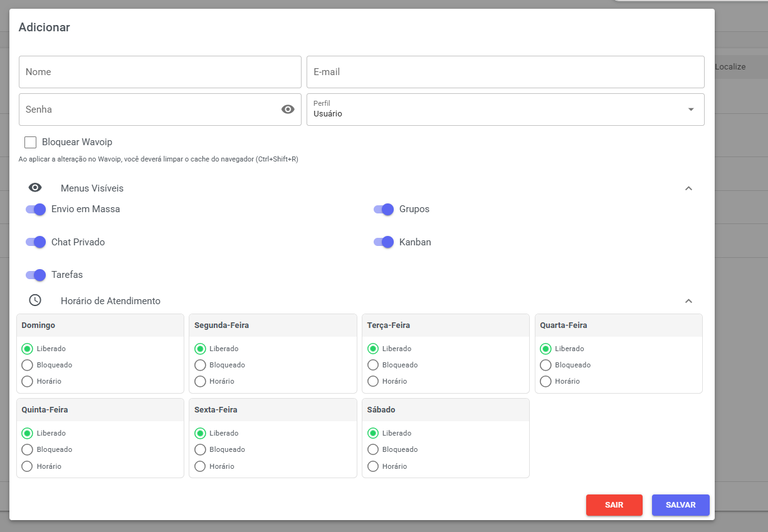
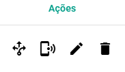

# Gerenciamento de Usuários

Esta seção é o seu painel **central** para a **gestão** dos usuários que utilizarão o sistema. Usuários referem-se aos **atendentes** e **colaboradores** responsáveis por gerenciar e executar o atendimento ao cliente da sua empresa.

## Novo Usuário

Somente um perfil de **Administrador** pode criar novos usuários. Para isso, clique no botão **Adicionar**, preencha todos os campos obrigatórios e, em seguida, selecione o **Perfil** (Usuário, Supervisor ou Administrador) que o novo membro irá possuir e **Salve** o novo cadastro.

| Campo | Descrição |
| :--- | :--- |
| **Nome** | Insira um nome para identificar esse usuário. Lembre-se que esse nome será visto pelos clientes caso acione a opção de **Assinatura** no atendimento. |
| **E-mail** | E-mail que o usuário usará para acessar a plataforma. |
| **Senha** | Senha de acesso para o usuário. |
| **Perfil** | Escolha entre Usuário, Supervisor e Administrador. Lembre-se que há um limite de cadastro de usuários, de acordo com o plano escolhido. |
| **Bloquear o Wavoip** | Ao aplicar a alteração no Wavoip, você deverá limpar o cache do navegador (Ctrl+Shift+R). |
| **Configuração SIP (Asterisk, FreeSWITCH, PBX, outros.)** | Usuário, Senha, Servidor e Porta. Seu ramal deve suportar WebRTC e WSS (WebSocket Secure). |
| **Menus Visíveis** | Você poderá controlar quais menus o usuário poderá acessar. Essa opção está disponível para usuários e supervisores. |
| **Horário de atendimento** | Você poderá controlar qual horário o usuário poderá realizar o login na plataforma. |

## Ações

Nesta área, você tem acesso a funcionalidades cruciais para a gestão do usuário:

* **Atribuir**: Vincular o usuário a uma **Fila** ou a uma **Equipe** existente.
* **Editar**: **Alterar** as informações de cadastro do usuário.
* **Excluir**: **Remover** o usuário permanentemente do sistema.
