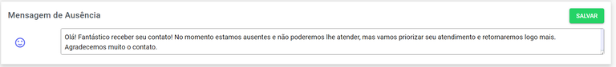

# Horário de Atendimento

Nesta seção, você pode definir e **gerenciar** o horário de **atendimento** da sua **empresa** com precisão. Configure a hora exata de abertura e fechamento para cada dia. Além disso, você pode criar e **personalizar** uma **mensagem** de **ausência** automática, garantindo que o cliente sempre receba uma comunicação clara quando você estiver fora do **expediente**.

## Configurar Horário de Funcionamento

A configuração de horários é muito simples. Você pode ajustar o funcionamento de cada dia da semana individualmente, escolhendo entre as seguintes opções:

| Campo | Descrição |
| :--- | :--- |
| **Aberto** | Informa ao cliente que a empresa está aberta **durante todo o dia**. Ideal para empresas que oferecem **suporte 24h** (deixe a opção acionada). |
| **Fechado** | Informa ao cliente que a empresa **não abre neste dia** da semana. |
| **Horário** | Ao ser selecionada, esta opção **desbloqueia os campos de horário**, permitindo definir um **intervalo de funcionamento** e, se necessário, um período específico para o almoço da equipe. |

## Mensagem de Ausência

Desenvolva uma mensagem que será enviada nos dias e horários que o **estabelecimento** estiver **fechado**. Aqui é possível inserir **emojis**.

Ao final lembre-se de clicar em **Salvar** para garantir que as alterações foram gravadas.

## Feriados

Os feriados são dias que o estabelecimento não está aberto. Esses dias serão considerados como dias fechados.

