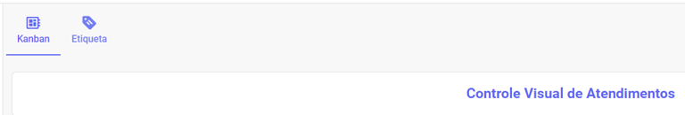
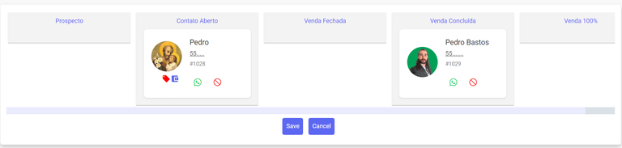
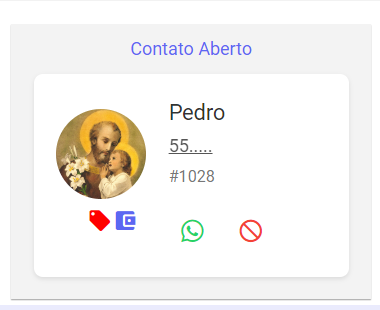
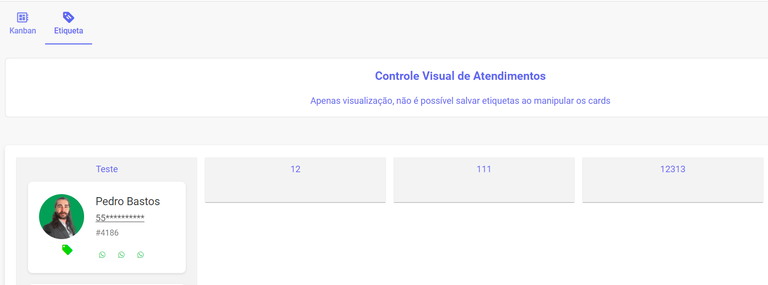

# Kanban de Atendimento (CRM)

:::info Aviso
**Qual Kanban Utilizar?**

O FalaMais.AI oferece duas visualizações Kanban distintas, cada uma dedicada a um objetivo específico:

- **Kanban** **de** **Atendimentos** (Página Atual): Usa Etiquetas (Tags) para organizar visualmente os atendimentos em andamento. É a ferramenta ideal para a gestão operacional da sua equipe de suporte.
- [**Kanban** **de** **Oportunidades**](funil/kanban.md): Utiliza as Etapas do Funil para organizar as oportunidades de negócio. É a ferramenta para a **gestão de processos comerciais.**
:::

Ao abrir a ferramenta, você será apresentado à tela de seleção, que oferece duas abas principais na parte superior:

- **Kanban**: Esta é a área onde você verá o Controle Visual de Atendimentos. Aqui, serão exibidos todos os kanbans que você criou e personalizou em Configurações, ou então, um controle visual direto dos atendimentos organizados pelas etiquetas que foram definidas para eles.
- **Etiqueta**: Esta aba permite que você gerencie e crie as etiquetas (tags) que serão usadas para classificar e visualizar seus atendimentos neste painel Kanban.

## Criação de cards Kanban

A **funcionalidade** de criação de novos cards para a estrutura Kanban está centralizada na área de Configurações, e não neste painel de visualização. Clique em aqui em ***Configurações*** para gerenciar a criação e a personalização dos seus cards.

## Aba Kanban

O modelo exibido é apenas um exemplo do que é possível criar. As funcionalidades do Kanban são **diversas** e podem ser **adaptadas** a inúmeros fluxos de trabalho. Por exemplo, você pode configurar este Kanban para visualizar e organizar seus atendimentos por categoria/fases de processo.

Mais do que apenas organizar tickets, esta função transforma o seu painel em uma ferramenta de **gestão** visual **robusta**. Ao dispor os atendimentos em colunas, você não só melhora drasticamente a organização e o fluxo de trabalho da equipe, mas também potencializa o uso da plataforma, transformando-a em um CRM poderoso para acompanhar o ciclo de vida dos seus contatos.

Ao visualizar o card, você tem acesso imediato aos dados primários do atendimento: Nome do Cliente, Foto de Perfil, Número do WhatsApp e o ID do Ticket. Na parte inferior do card, duas ações rápidas estão disponíveis: Retomar o Atendimento (para continuar a conversa) e a opção de Retirar a atribuição do Kanban, permitindo que você redefina a classificação visual do ticket.

Lembre-se de que você pode arrastar e mover os contatos entre as colunas conforme o atendimento avança. Isso garante que os dados do seu Kanban estejam sempre atualizados. Após todas as movimentações, clique em Salvar para registrar as alterações.

## Aba Etiquetas

Esta área é dedicada à visualização dos cards que são gerados automaticamente com base nas **etiquetas** (tags) definidas para cada atendimento. É fundamental entender que este painel atua como um **espelho**: ele apenas exibe a **organização**. Se você manipular os cards aqui (movimentá-los entre colunas), essa ação não salva nem altera as etiquetas associadas ao atendimento.

