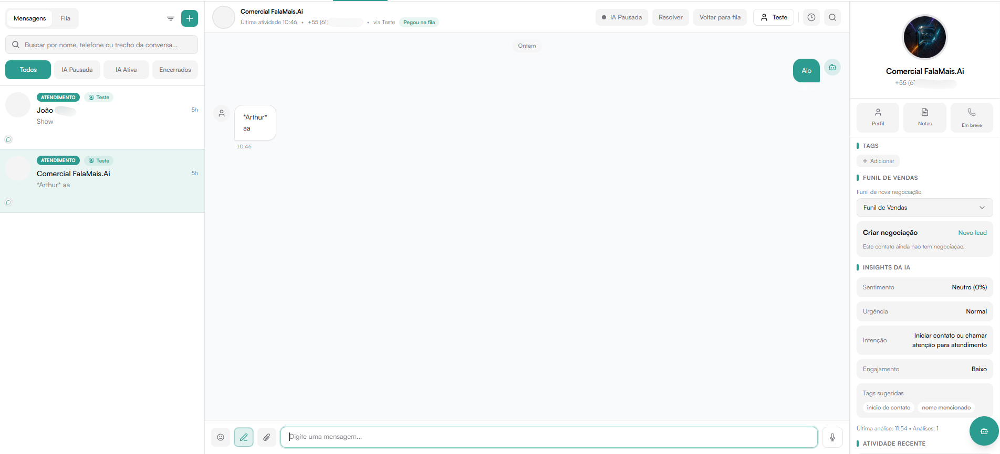

# Mensagens

A aba **Mensagens** é o centro de atendimento em tempo real da plataforma.

Aqui é possível:

- Visualizar conversas ativas
- Atender clientes
- Transferir atendimentos
- Encerrar conversas
- Aplicar tags
- Criar negociações
- Utilizar recursos de IA
- Acompanhar insights e atividades

# Estrutura da Tela

A aba de Mensagens é dividida em três áreas principais:

1. Lista de Conversas (esquerda)
2. Conversa Ativa (centro)
3. Painel Lateral de Informações (direita)

## Lista de Conversas

Localizada no lado esquerdo da tela.

Funcionalidades disponíveis:

- Campo de busca por nome, telefone ou trecho da conversa.
- Filtros rápidos:
  - Todos
  - IA Pausada
  - IA Ativa
  - Encerrados
- Indicador de mensagens na Fila.
- Botão **Pegar** para assumir um atendimento da fila.

### Fila de Atendimento

Conversas que ainda não foram atribuídas ficam na **Fila**.

Ao clicar em **Pegar**, o atendimento passa a ser responsabilidade do atendente.

## Conversa Ativa

Exibida no centro da tela quando uma conversa é selecionada.

Informações exibidas:

- Nome do contato
- Telefone
- Canal de origem
- Status (ex: Pegou na fila)

### Ações disponíveis no topo:

- **IA Pausada** → Pausa o atendimento automatizado.
- **Resolver** → Finaliza o atendimento.
- **Voltar para fila** → Remove da responsabilidade e retorna à fila.
- Ícones adicionais de interação (ex: histórico, busca).

### Campo de envio de mensagem

Na parte inferior da conversa:

- Campo de texto para digitar mensagens.
- Suporte a envio via Enter.
- Ícone de anexo (quando disponível).
- Botão de gravação de áudio (se habilitado).

Permite comunicação direta com o cliente em tempo real.

## Painel Lateral

Exibe informações estratégicas do contato durante o atendimento.

### Perfil

Botões rápidos:

- Perfil → Abre o perfil completo do contato.
- Notas → Visualiza ou adiciona observações.
- Em breve → Funcionalidades adicionais futuras.

### Tags

Permite adicionar ou remover tags no contato durante o atendimento.

Importante:
O botão de tags nesta tela gerencia apenas as tags vinculadas ao contato atual.
O gerenciamento geral (criação e mesclagem) é feito em Configurações > Tags.

### Funil de Vendas

Permite:

- Selecionar o funil padrão para nova negociação.
- Criar negociação diretamente da conversa.

Se o contato ainda não tiver negociação ativa, será exibida a opção:

**Novo lead**

### Insights da IA

Área dedicada à análise automática da conversa.

Pode exibir:

- Sentimento
- Urgência
- Intenção
- Engajamento

Quando disponível, permite clicar em:

**Analisar conversa**

Esses dados auxiliam na priorização e abordagem estratégica.

### Atividade Recente

Exibe ações recentes relacionadas ao contato, como:

- Nota adicionada
- Mudança de etapa
- Transferência de atendimento
- Encerramento

Serve como histórico rápido de contexto.

## Fluxo de Atendimento

1. Conversa entra na Fila.
2. Atendente clica em Pegar.
3. Atendimento é realizado.
4. Pode-se:
   - Aplicar tags
   - Criar negociação
   - Adicionar notas
5. Finalizar clicando em Resolver.

# Encerramento da Conversa

Ao clicar em Resolver:

- A conversa é marcada como encerrada.
- Pode ser movida para a aba Encerrados.
- Pode impactar métricas de tempo de resolução.

## Impacto nas Métricas

As ações realizadas na aba Mensagens impactam diretamente:

- Tempo de primeira resposta
- Tempo de resolução
- FCR
- CSAT
- Volume de atendimentos
- Performance individual

A aba Mensagens é o núcleo operacional da plataforma, sendo fundamental para produtividade, organização e qualidade no atendimento.
