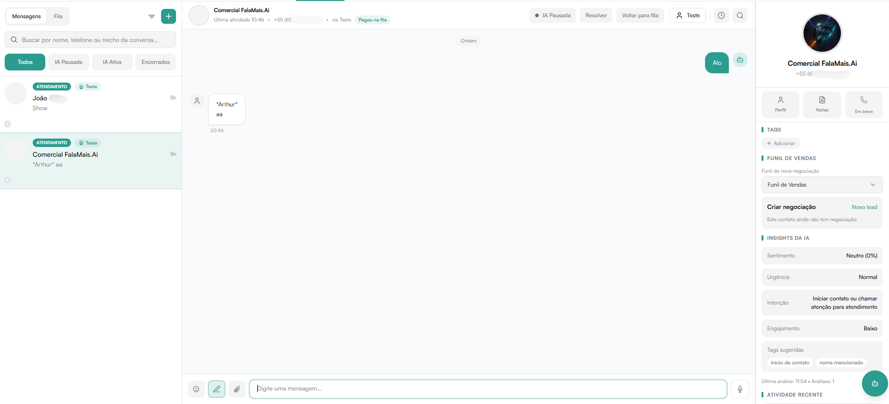

# Mensagens

A aba **Mensagens** é o centro de atendimento em tempo real da plataforma.

Aqui é possível:

- Visualizar conversas ativas
- Atender clientes
- Transferir atendimentos
- Encerrar conversas
- Aplicar tags
- Criar negociações
- Utilizar recursos de IA
- Acompanhar insights e atividades

## Estrutura da Tela

A aba de Mensagens é dividida em três áreas principais:

1. Lista de Conversas (esquerda)
2. Conversa Ativa (centro)
3. Painel Lateral de Informações (direita)

### Lista de Conversas

Localizada no lado esquerdo da tela.

Funcionalidades disponíveis:

- **Campo de busca** → Localiza conversas por nome do contato, telefone ou trecho da mensagem.
- **Filtro e ordenação** → Ícone de funil ao lado da busca que permite ordenar e filtrar as conversas da lista.
- **Botão "+"** → Inicia uma nova conversa com um contato.
- Filtros rápidos:
  - **Todos** → Exibe todas as conversas em atendimento.
  - **IA Pausada** → Mostra conversas onde a IA foi pausada manualmente.
  - **IA Ativa** → Mostra conversas onde a IA está respondendo automaticamente.
  - **Encerrados** → Conversas que foram finalizadas.
- **Indicador de Fila** → Mostra quantas conversas estão aguardando atendimento.
- **Botão "Pegar"** → Aparece em conversas da fila, permitindo ao atendente assumir o atendimento.

#### Fila de Atendimento

Conversas que ainda não foram atribuídas ficam na **Fila**.

Ao clicar em **Pegar**, o atendimento passa a ser responsabilidade do atendente.

### Conversa Ativa

Exibida no centro da tela quando uma conversa é selecionada.

Ao iniciar uma conversa pela ação **Mensagem** dentro de uma negociação, a área
de Mensagens abre em uma nova guia e já identifica o contato correto. Assim, a
negociação permanece aberta na guia original para consulta.

Informações exibidas:

- Nome do contato
- Telefone
- Canal de origem
- Status (ex: Pegou na fila)

#### Ações disponíveis no topo:

- **IA Pausada** → Indica que a IA está pausada nessa conversa. Clicar reativa a IA.
- **IA Bloqueada** → Aparece em vermelho quando a IA foi bloqueada manualmente no painel lateral. Significa que a IA não vai responder nessa conversa até ser desbloqueada.
- **Resolver** → Finaliza o atendimento e marca a conversa como encerrada.
- **Voltar para fila** → Remove a conversa da responsabilidade do atendente e a retorna à fila geral.
- **Trocar canal** → Permite transferir a conversa para um canal de comunicação diferente (ex: de WhatsApp para outro número ou canal configurado).
- Ícones adicionais: histórico de interações e busca dentro da conversa.

#### Campo de envio de mensagem

Na parte inferior da conversa fica a barra de envio, com os seguintes recursos:

- **Campo de texto** → Onde a mensagem é digitada. O envio acontece pressionando Enter.
- **Emoji** → Abre o seletor de emojis para enriquecer a mensagem.
- **Nota interna** → Envia uma mensagem que só os atendentes conseguem ver, sem o cliente receber.
- **Anexo** → Permite enviar arquivos, imagens ou documentos.
- **Melhorar com IA** → Sugere melhorias na mensagem digitada antes de enviar, com base no contexto da conversa.
- **Gravação de áudio** → Grava e envia um áudio diretamente para o cliente.

#### Mensagem sugerida de aniversário

Quando você abre uma notificação de aniversário pelo botão **Revisar mensagem
sugerida**, o FalaMais.AI localiza a conversa do contato e preenche o campo de
texto com a saudação sugerida. A mensagem não é enviada automaticamente: revise,
personalize se necessário e confirme o envio normalmente.

Quando a conversa usa uma conexão WhatsApp via **UAZAPI**, também é possível enviar uma mensagem com até três botões de ação. Esses botões aparecem junto da mensagem no histórico do chat e no WhatsApp do cliente. Links enviados em mensagens de texto aparecem clicáveis no histórico da conversa.

Tipos de botão disponíveis:

- **Resposta** → o cliente toca no botão e a resposta volta para a conversa.
- **Link** → abre uma página externa.
- **Copiar** → mostra ao cliente uma opção para copiar um código ou texto curto.
- **Ligar** → abre a chamada telefônica no aparelho do cliente.

:::info[Disponibilidade]
Botões manuais ficam disponíveis apenas em conversas enviadas por conexões UAZAPI. Em outros canais, use mensagens de texto, mídia, templates oficiais ou respostas rápidas compatíveis com o canal.
:::

#### Eventos especiais no chat

Durante uma conversa, alguns eventos do sistema aparecem no meio das mensagens:

- **"Conversa devolvida para fila"** → Indica que o atendimento foi retornado à fila, seja pelo atendente ou automaticamente.
- **"AGENDAMENTO ENVIADO"** → Aparece como um badge em mensagens que continham um agendamento, indicando que ele foi enviado com sucesso.

Mensagens enviadas automaticamente pela IA aparecem com um ícone de robô ao lado, facilitando identificar o que foi respondido pelo atendente e o que foi respondido pelo assistente.

### Painel Lateral

Exibe informações estratégicas do contato durante o atendimento.

#### Perfil

Botões rápidos:

- **Perfil** → Abre o perfil completo do contato.
- **Notas** → Visualiza ou adiciona observações internas sobre o cliente.
- **Desbloquear IA** → Reativa a inteligência artificial na conversa, caso ela esteja bloqueada.
- **Bloquear contato** → Impede que o contato envie novas mensagens para a plataforma.

#### Tags

Permite adicionar ou remover tags no contato durante o atendimento.

Importante:
O botão de tags nesta tela gerencia apenas as tags vinculadas ao contato atual.
O gerenciamento geral (criação e mesclagem) é feito em Configurações > Tags.

#### Funil de Vendas

Permite:

- Selecionar o funil padrão para nova negociação.
- Criar negociação diretamente da conversa.

Se o contato ainda não tiver negociação ativa, será exibida a opção:

**Novo lead**

#### Insights da IA

Área dedicada à análise automática da conversa, gerada pela inteligência artificial da plataforma.

Exibe as seguintes informações:

- **Sentimento** → Como o cliente está se sentindo na conversa (ex: Neutro, Positivo, Negativo) com um percentual de confiança.
- **Urgência** → Nível de urgência percebido pela IA (ex: Baixa, Média, Alta).
- **Intenção** → O que a IA identificou como objetivo do cliente na conversa (ex: "Cliente iniciando contato sem demanda clara").
- **Engajamento** → Grau de envolvimento do cliente na conversa (ex: Baixo, Médio, Alto).
- **Tags sugeridas** → A IA sugere tags relevantes com base no conteúdo da conversa, que podem ser aplicadas ao contato com um clique.
- **Última análise** → Data e quantidade de vezes que a IA analisou essa conversa.

Quando disponível, o botão **Analisar conversa** força uma nova análise da IA sobre o histórico atual.

Esses dados ajudam o atendente a entender o contexto rapidamente e priorizar o atendimento de forma estratégica.

#### Atividade Recente

Exibe um histórico rápido das ações mais recentes relacionadas ao contato, como:

- **Mensagem enviada** → O atendente ou a IA enviou uma mensagem para o cliente.
- **Mensagem recebida** → O cliente enviou uma mensagem.
- **IA respondeu automaticamente** → A IA respondeu ao cliente sem intervenção humana.
- **Nota adicionada** → Um atendente registrou uma observação interna.
- **Mudança de etapa** → O contato avançou ou retrocedeu em um funil de vendas.
- **Transferência de atendimento** → A conversa foi transferida para outro atendente ou equipe.
- **Encerramento** → A conversa foi finalizada.

Serve como histórico rápido de contexto para o atendente entender o que já aconteceu antes de interagir.

## Fluxo de Atendimento

1. Conversa entra na Fila.
2. Atendente clica em Pegar.
3. Atendimento é realizado.
4. Pode-se:
   - Aplicar tags
   - Criar negociação
   - Adicionar notas
5. Finalizar clicando em Resolver.

## Encerramento da Conversa

Ao clicar em Resolver:

- A conversa é marcada como encerrada.
- Pode ser movida para a aba Encerrados.
- Pode impactar métricas de tempo de resolução.

## Impacto nas Métricas

As ações realizadas na aba Mensagens impactam diretamente:

- Tempo de primeira resposta
- Tempo de resolução
- FCR
- CSAT
- Volume de atendimentos
- Performance individual

A aba Mensagens é o núcleo operacional da plataforma, sendo fundamental para produtividade, organização e qualidade no atendimento.
