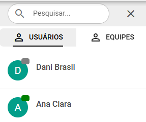

# Chat Interno Entre os Usuários

Este chat foi projetado para otimizar a comunicação interna da sua empresa. Use-o para realizar reuniões e alinhamentos de forma eficiente, tanto em conversas individuais quanto em grupos.

## Menu superior esquerdo

- O botão *Home*, serve para retornar ao painel de controle.
- O botão *Atendimento*, serve para voltar a tela de atendimentos.
- E o botão *Reduzir*, serve para reduzir/esconder a lista de usuários.

## Menu lateral a direita
 
No menu lateral, você pode encontrar usuários e grupos, e iniciar conversas com eles. Para facilitar, 
utilize o campo de busca para encontrar rapidamente o que precisa.

## Menu inferior

Use esta caixa de texto para escrever mensagens, anexar arquivos, adicionar emojis, enviar áudios ou compartilhar links de videoconferências.
