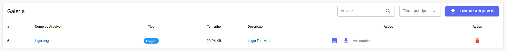
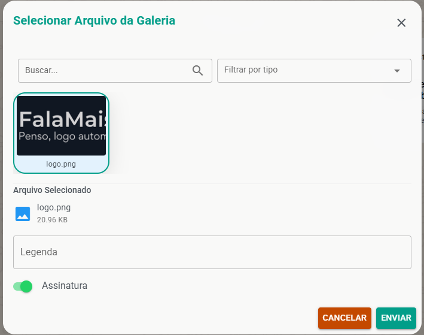

# Galeria de Arquivos

A Galeria funciona como um **repositório** centralizado de arquivos no FalaMais.AI. Nela, é possível armazenar **documentos, assetsGal/imagens e vídeos importantes** diretamente na nuvem do sistema, permitindo que qualquer **atendente** envie esses arquivos rapidamente durante uma **conversa**, sem precisar fazer novos **uploads** a partir do computador local.

:::tip Dica
Dica de **Produtividade**: Utilize a Galeria para armazenar catálogos de produtos, PDFs de apresentação da empresa, tabelas de preços e manuais de instrução. Isso garante que todos os atendentes enviem sempre a versão mais atualizada do documento.
:::

## Gerenciando os Arquivos

Primeiramente, é preciso **preencher** a galeria com os **materiais** que serão **utilizados** pela sua equipe.

1. Nessa tela você verá a listagem de todos os arquivos **cadastrados**, podendo pesquisar e excluir itens existentes.

2. Para inserir um novo item, clique no botão "**Enviar arquivos**".
3. Faça o **upload** do arquivo **desejado** e defina uma Descrição para o arquivo (este nome facilitará a busca pelo atendente).
4. Clique em "**Enviar**" para salvar.

---

## Enviando Arquivos da Galeria no Atendimento

Com os arquivos salvos, o envio durante o atendimento torna-se muito mais ágil.

1. Dentro da tela de atendimento (Ticket), clique no ícone de **anexo** (três pontos).
2. Selecione a nova opção "**Enviar arquivo da Galeria**".

3. Uma **janela** se abrirá listando os arquivos **disponíveis**. Localize o arquivo que deseja (você pode usar a busca pelo nome ou filtro)

4. **Pronto**! O arquivo será enviado imediatamente para o cliente na conversa.