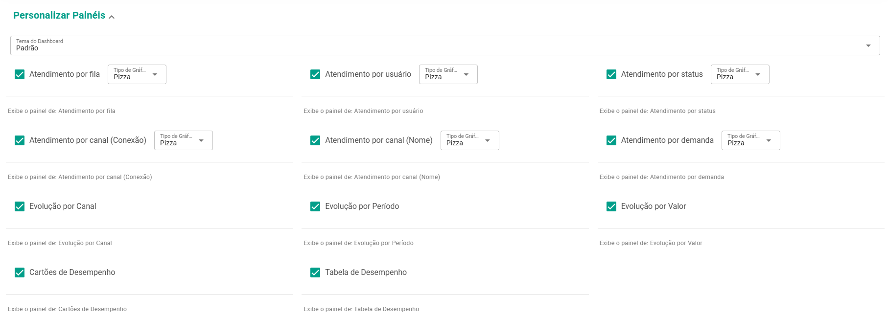
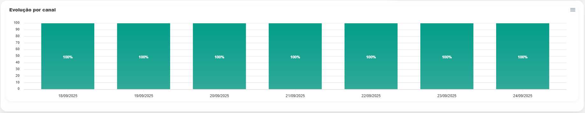
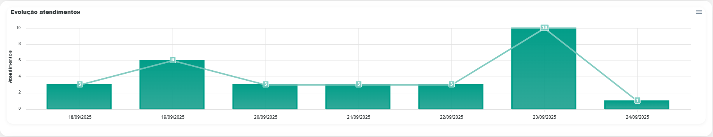
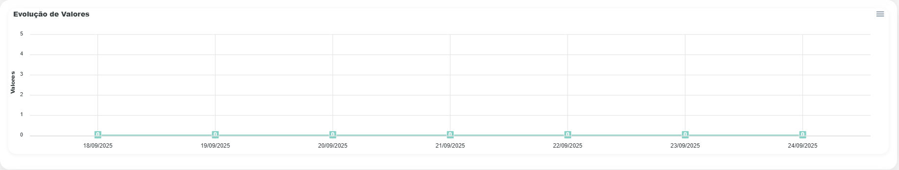
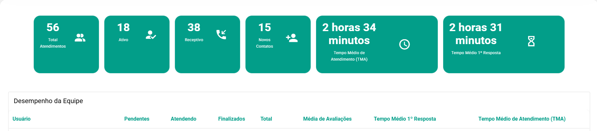

# Painel de Controle

:::info 
**Disponível para o perfil: Administrador, Supervisor e Usuário**
:::

<iframe width="700" height="410" src="https://www.youtube.com/embed/Bedlh7HeViE?si=8rIkWE30TbAtajnL" title="YouTube video player" frameborder="0" allow="accelerometer; autoplay; clipboard-write; encrypted-media; gyroscope; picture-in-picture; web-share" referrerpolicy="strict-origin-when-cross-origin" allowfullscreen></iframe>

O painel de controle é a sua tela inicial, o primeiro espaço que você vê ao fazer *login*. 

<!-- *colocar imagem talvez* -->

:::tip dica
Você pode gerar o seu ***DashBoard*** a partir de um certo período, basta escolher a data e gerar o ***DashBoard***. E caso queira incluir as conversas em grupos na análise basta selecionar o filtro ao lado do botão de **gerar**.
:::

## Personalizar o Painel

Você pode personalizar o seu *Dashboard* selecionando os tipos de gráficos desejados:

- Pizza
- Barra
- Linhas
- Áreas
- Radar
- Rosca 

Além de definir quais deles exibir e escolher o tema do *Dashboard*.

## Atendimento por fila

Apresenta a distribuição dos atendimentos por fila de atendimento.

## Atendimento por usuário

Apresenta a porcentagem de atendimentos realizados por cada atendente/colaborador.

## Atendimento por status

Apresenta a proporção entre atendimentos abertos, fechados e pendentes.

## Atendimento por canal (Conexão)

Apresenta a origem dos atendimentos conforme a conexão configurada.

## Atendimento por canal (Nome)

Apresenta a distribuição de atendimentos considerando o nome do canal.

## Atendimento por demanda

Apresenta a classificação dos atendimentos por tipo de demanda. Que pode ser configurada [Aqui em Demandas](intro.md). *mudar caminho dps*

## Evolução por Canal

No relatório de Evolução por Canal, você acompanha a porcentagem de atendimentos realizados pelo *WhatsApp*, WABA e Telegram ao longo do tempo.

## Evolução por Atendimentos

Aqui é possível acompanhar a quantidade de atendimentos realizados ao longo do tempo.

##  Evolução por Valor

É possível acompanhar a evolução dos leads através de valores numéricos, como por exemplo, o valor de negociação de cada um.

##  Desempenho da Equipe

Aqui você pode acompanhar o desempenho da sua equipe, monitorando as atividades de cada usuário cadastrado na plataforma dentro do período selecionado.

| Campo              | Descrição                                                                     |
|--------------------|-------------------------------------------------------------------------------|
| **Usuário**            | Nome dos atendentes/colaboradores.                                        |
| **Pendente**           | Atendimentos não iniciados.                                               |
| **Atendendo**          | Atendimentos em andamento.                                                |
| **Finalizados**        | Atendimentos fechados.                                                    |
| **Total**              | Total de atendimentos por usuário.                                        |
| **Média de Avaliações**| Os clientes podem dar uma nota de 0 a 5 para o atendimento. Para ter uma visão mais abrangente acesse [**Avaliações**](canal/canal.md). |
| **T.M.R**             | Tempo Médio da 1° Resposta                                                |
| **T.M.A**              | Tempo Médio de Atendimento                                                |

:::tip dica

É possível **exportar** qualquer gráfico nos formatos **SVG**, **PNG** ou **CSV**. Basta clicar no canto superior direito do gráfico e selecionar a opção de *download*.

:::