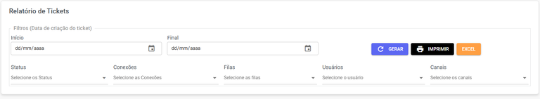
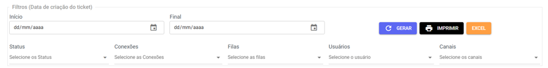
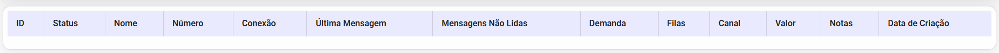

# Relatório de Atendimento

## Funcionalidades da Página

Obtenha uma visão **customizada** dos seus dados de atendimento! Com nossos filtros flexíveis, você pode modelar o relatório do jeito que achar mais **estratégico** para a sua análise. 

:::warning Atenção
Esta funcionalidade está em fase de testes (**Beta**) e pode sofrer alterações ou ajustes.
:::

| Descrição | Ação |
| :--- | :--- |
|  | Aqui você pode escolher quais **filtros** irá usar para gerar os **relatórios**. |
|  | Clique para **gerar o relatório** após selecionar as datas. Os dados serão atualizados e exibidos na tela. |
|  | Use este botão para **imprimir o relatório** ou **baixá-lo em formato PDF**. |
|  | **Baixe o relatório** completo em formato de planilha **Excel**. |

Abaixo das **funcionalidadas**, você encontrará a lista gerada com as seguintes informações:

* **Id**
* **Status**
* **Nome**
* **Número**
* **Conexão**
* **Última Mensagem**
* **Mensagens não lidas**
* **Demanda**
* **Filas**
* **Canal**
* **Valor**
* **Notas**
* **Data de criação**