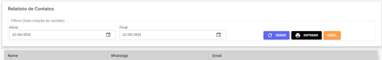
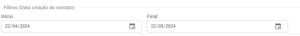

# Relatório de Contatos

Nesta seção, você pode selecionar um **período** e gerar um **relatório** com todos os contatos criados.

## Funcionalidades da Página

Essa funcionalidade oferece a **flexibilidade** necessária para transformar um grande volume de dados em informação acionável. Ao aplicar filtros, você deixa de ver uma lista genérica e passa a ter relatórios específicos

| Descrição | Ação |
| :--- | :--- |
|  | **Determine o período** para a criação dos contatos que você deseja incluir no relatório. |
|  | Clique para **gerar o relatório** após selecionar as datas. Os dados serão atualizados e exibidos na tela. |
|  | Use este botão para **imprimir o relatório** ou **baixá-lo em formato PDF**. |
|  | **Baixe o relatório** completo em formato de planilha **Excel**. |

Abaixo das **funcionalidadas**, você encontrará a lista gerada com as seguintes informações:

- **Nome**
- **WhatsApp**
- **Email**
- **Informações** **extras**