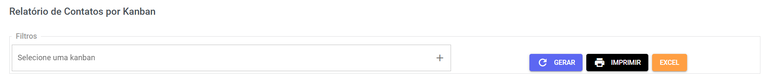
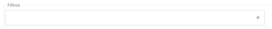
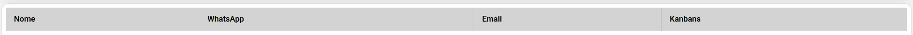

# Relatório de Contato por Kanban

## Funcionalidades da Página

Diferente do relatório de contatos, para este você deve selecionar uma **etapa** do **Kanban** antes de gerar o relatório.

| Descrição | Ação |
| :--- | :--- |
|  | Aqui você pode **escolher** qual ou quais **etapas do Kanban** aparecerão no relatório. |
|  | Clique para **gerar o relatório** após selecionar as datas. Os dados serão atualizados e exibidos na tela. |
|  | Use este botão para **imprimir o relatório** ou **baixá-lo em formato PDF**. |
|  | **Baixe o relatório** completo em formato de planilha **Excel**. |

Abaixo das **funcionalidadas**, você encontrará a lista gerada com as seguintes informações:

- **Nome**
- **WhatsApp**
- **Email**
- **Kanbans**