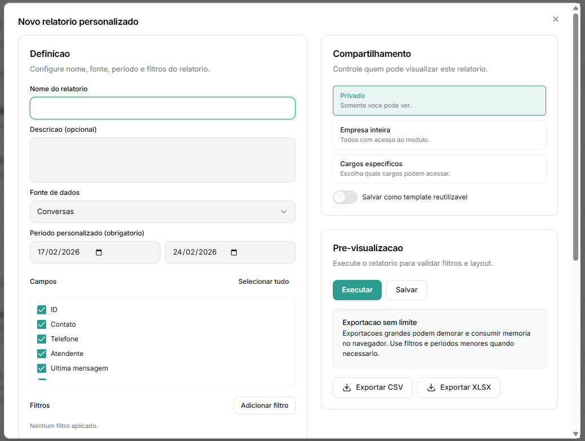
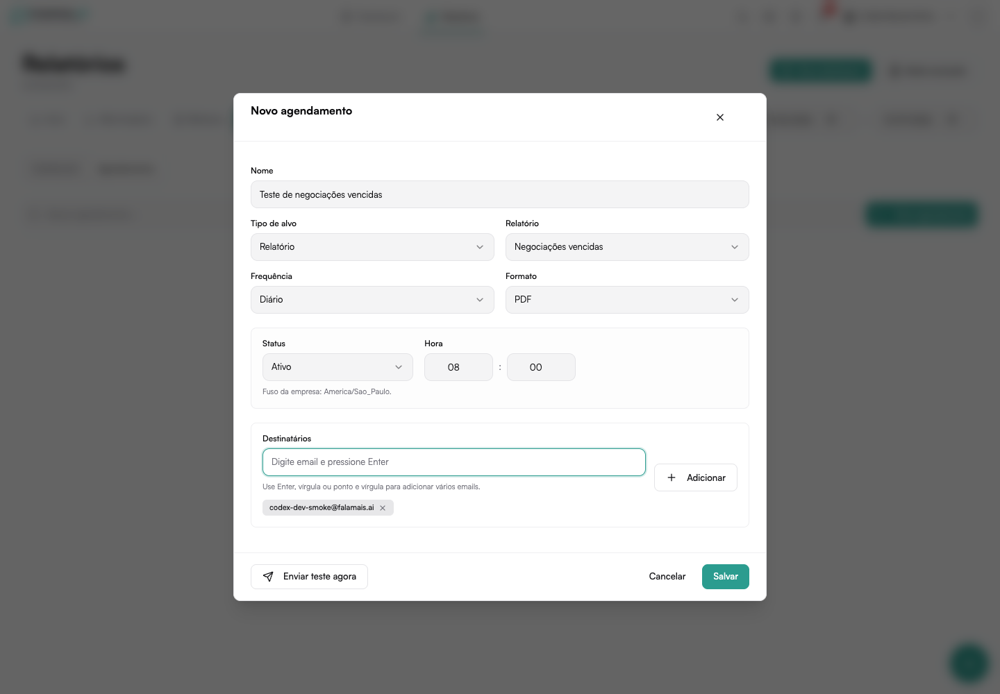

# Relatórios

A área de **Relatórios** permite criar análises personalizadas a partir dos dados do sistema e organizá-las visualmente em **Dashboards**.

Existem duas abas principais:

- **Relatórios**
- **Dashboards**

## Fluxo de Uso

1. Criar um relatório personalizado  
2. Criar um dashboard  
3. Adicionar os relatórios como widgets dentro do dashboard  

# Aba: Relatórios

Nesta aba você pode:

- Criar relatórios personalizados
- Utilizar templates prontos
- Editar relatórios existentes
- Exportar dados (CSV ou XLSX)
- Definir permissões de visualização

## Templates Sugeridos

Modelos prontos para agilizar a criação:

### Pipeline de vendas
Exibe quantidade e/ou soma por etapa do funil.

### Conversas por agente
Mostra o volume de conversas distribuídas por atendente.

### Mensagens por status
Distribui mensagens por status (ativa, pausada, encerrada etc.).

### Produtividade de tarefas
Mostra tarefas criadas e concluídas por responsável, percentual concluído no
prazo e tempo médio até a conclusão.

### Ligações por vendedor
Compara quantidade, resultado, tempo total e médio de conversa e o tempo de
ligação acumulado antes das conversões.

### Negociações vencidas
Lista negociações ainda abertas cuja data prevista de fechamento já passou.
Esse modelo também pode ser incluído nos e-mails agendados do gestor.

### Desconto médio por vendedor
Compara o desconto aplicado nos itens da negociação com a referência definida
no catálogo de produtos.

Você pode clicar em **Usar template** e depois personalizar filtros e visualização.

## Criando um Novo Relatório

Clique em **Novo relatório**.

A configuração é dividida em três blocos:

1. Definição  
2. Análise e Exibição
3. Compartilhamento  
4. Pré-visualização  

### 1. Definição

#### Nome do Relatório (Obrigatório)

Escolha um nome claro e descritivo.

**Exemplos:**
- Conversas da Semana
- Pipeline Janeiro
- Leads Qualificados

#### Descrição (Opcional)

Explique o objetivo da análise.

#### Fonte de Dados

Selecione a origem das informações:

- Conversas
- Mensagens
- Deals (Negociações)
- Negociações vencidas
- Tarefas
- Ligações
- Descontos por item
- Contatos
- Funis
- Usuários
- Times

A fonte escolhida define:
- Quais campos estarão disponíveis
- Quais métricas poderão ser utilizadas

#### Período Personalizado (Obrigatório)

Todos os relatórios exigem um intervalo de datas:

- Data inicial
- Data final

Sem período definido, o relatório não pode ser executado.

#### Campos

Selecione as colunas que aparecerão na tabela de dados.

**Exemplos:**
- ID
- Contato
- Telefone
- Atendente
- Última mensagem
- Criado em

Você pode usar **Selecionar tudo** para incluir todos os campos.

#### Filtros

Permite refinar os resultados.

Clique em **Adicionar filtro** e escolha:

- Campo
- Operador (igual, diferente, contém, etc.)
- Valor

Filtros ajudam a:
- Segmentar dados
- Criar relatórios específicos
- Reduzir volume de exportação

### 2. Análise e Exibição

Define como os dados serão consolidados e apresentados.

#### Agrupar por

Você pode agrupar dados por:

- ID
- Contato
- Telefone
- Atendente
- Última mensagem
- Criado em

**Exemplo:**
Agrupar por Atendente → Mostra total de conversas por agente.

#### Métricas

Você pode selecionar:

- **Contagem**
- **Soma** (quando houver campos numéricos)

Se a fonte não possuir campos numéricos, a soma não estará disponível.

Algumas fontes também oferecem **média**, **mínimo** e **máximo**. Nas novas
fontes comerciais, isso permite medir tempo até conclusão, duração das
ligações, dias de atraso e diferença entre desconto aplicado e referência.

#### Tipo de Gráfico

Escolha como os dados serão exibidos:

- Sem gráfico (somente tabela)
- Barras
- Linha
- Área

Também é possível ativar:

✔ Mostrar tabela de dados

### 3. Compartilhamento

Controle quem pode visualizar o relatório:

- Privado (somente você)
- Empresa inteira
- Cargos específicos

Você também pode:

Salvar como template reutilizável

### 4. Pré-visualização

Antes de salvar definitivamente, você pode:

- Executar o relatório
- Validar filtros
- Conferir layout

Botões disponíveis:

- Executar
- Salvar
- Exportar CSV
- Exportar XLSX

#### Exportação

Formatos disponíveis:

- CSV
- XLSX

⚠ Relatórios muito grandes podem:

- Demorar para gerar
- Consumir mais memória no navegador

Recomenda-se utilizar filtros e períodos menores quando necessário.

## Gerenciamento de Relatórios

Na listagem principal você pode:

- Abrir
- Duplicar
- Remover

Cada relatório exibe:
- Fonte de dados
- Data da última atualização

## Envio agendado e teste de e-mail

Em **Relatórios → Explorar**, abra a área de entregas e crie um agendamento
diário, semanal ou mensal. Selecione o relatório ou dashboard, formato e
destinatários.

O horário usa o **fuso da empresa**, exibido logo abaixo do campo. Antes de
salvar, clique em **Enviar teste agora**. O sistema gera o relatório com a
configuração atual e envia para os destinatários informados, sem criar o
agendamento e sem alterar a data do último envio.

Use o teste para conferir:

- recebimento no endereço correto;
- assunto e período do resumo;
- abertura do arquivo anexo;
- filtros e colunas do relatório.
