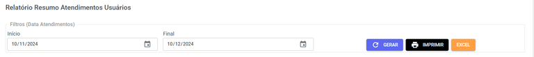
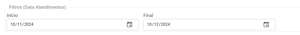

# Resumo de Atendimentos por Usuário

## Funcionalidades da Página

Gere um relatório que resume os dados de atendimento de cada usuário no sistema. Utilize essa visão para monitorar a performance da sua equipe.

| Descrição | Ação |
| :--- | :--- |
|  | Aqui você pode **filtrar** os **atendimentos** por data |
|  | Clique para **gerar o relatório** após selecionar as datas. Os dados serão atualizados e exibidos na tela. |
|  | Use este botão para **imprimir o relatório** ou **baixá-lo em formato PDF**. |
|  | **Baixe o relatório** completo em formato de planilha **Excel**. |

Abaixo das **funcionalidadas**, você encontrará a lista gerada com as seguintes informações:

* **Nome**
* **E**-**mail**
* **Pendentes**
* **Em** **Atendimento**
* **Resolvidos**
* **Total**