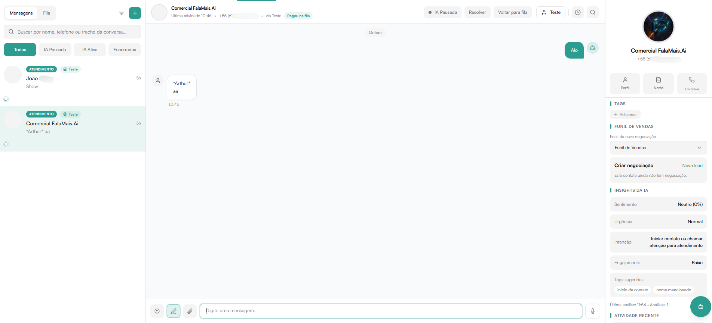

# Sussurros internos no atendimento

Os sussurros são mensagens privadas trocadas pela equipe dentro da conversa do
cliente. Eles servem para pedir apoio, registrar um contexto rápido ou alinhar
um próximo passo sem enviar nada ao WhatsApp do contato.

## Como enviar

1. Abra a conversa do contato.
2. No campo de mensagem, selecione o modo de mensagem interna.
3. Escreva o recado e envie.

O sussurro aparece no histórico em um balão amarelo, identificado como
**Interno** e com o nome de quem o enviou. O cliente não recebe, não visualiza
e não tem acesso a esse conteúdo.

## Quem pode ver

Somente pessoas que já têm permissão para abrir aquela conversa conseguem ler
ou enviar sussurros nela. A permissão é conferida a cada acesso, inclusive se o
atendimento mudar de responsável.

## Mensagens novas

Se você estiver lendo uma parte mais antiga da conversa quando chegar um
sussurro, o FalaMais.AI mostra o aviso de nova mensagem no fim do histórico.
Ao selecionar o aviso, a conversa volta para as mensagens mais recentes.

