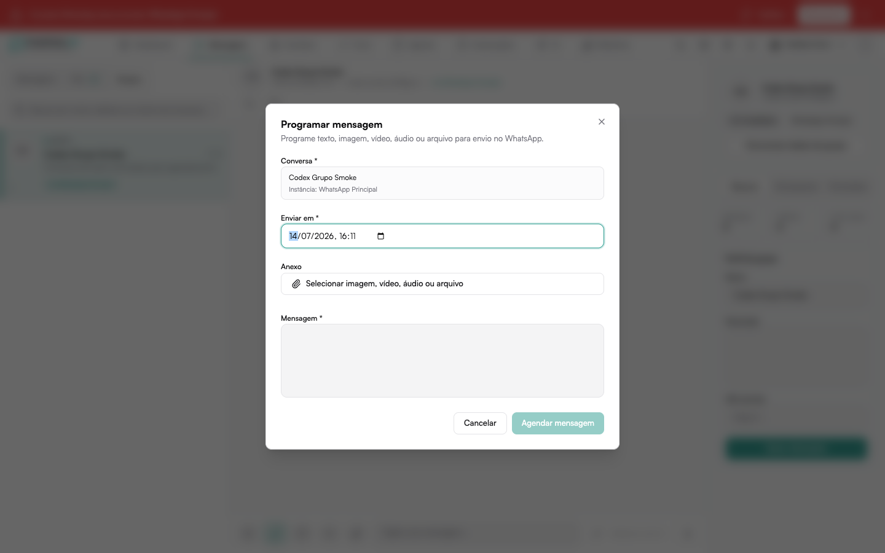

# Mídia no cabeçalho de templates do WhatsApp

Alguns templates oficiais do WhatsApp usam uma imagem, vídeo ou documento no
cabeçalho. Ao selecionar um desses templates no envio, em uma campanha ou em
um follow-up, você pode preencher essa mídia sem precisar hospedar o arquivo
por conta própria.

## Como anexar a mídia

1. Escolha o template que possui cabeçalho de mídia.
2. No campo do cabeçalho, selecione **Enviar arquivo**.
3. Escolha a imagem, o vídeo ou o documento.
4. Aguarde o upload terminar e conclua o envio normalmente.

O FalaMais.AI armazena o arquivo e preenche automaticamente o link usado pelo
template. Se a mídia já estiver disponível em outro local, você também pode
informar o endereço do arquivo diretamente.

:::info[Template aprovado]
O tipo de mídia deve ser o mesmo aprovado no template oficial. Por exemplo, um
template aprovado com cabeçalho de imagem não aceita um vídeo nesse campo.
:::
