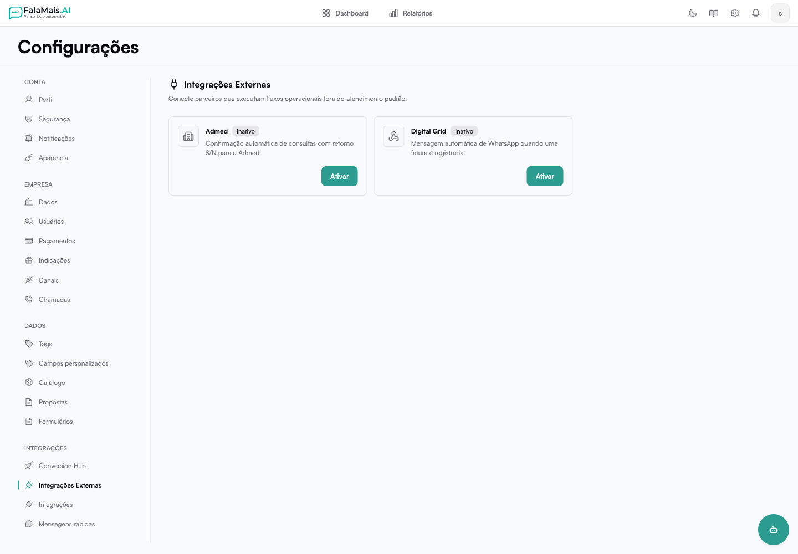

# Webhooks de entrada

Os webhooks de entrada permitem que a Digital Grid envie eventos para um
endereço exclusivo da sua empresa no FalaMais.AI. Cada evento pode identificar
ou criar um contato e disparar uma mensagem de WhatsApp conforme uma regra
configurada.

## Abrir a integração

1. Acesse **Configurações → Integrações → Integrações Externas**.
2. Abra **Digital Grid**.
3. Selecione a linha WhatsApp padrão que enviará as mensagens.
4. Configure o mapeamento dos campos e salve.

## Mapear os dados do cliente

Informe em qual caminho do conteúdo recebido estão:

- nome;
- telefone;
- CPF ou CNPJ;
- e-mail.

Os caminhos usam a estrutura JSON enviada pela Digital Grid. Utilize o teste de
mapeamento para conferir os dados encontrados antes de ativar a integração. O
FalaMais.AI procura primeiro um contato existente e só cria um novo registro
quando as informações recebidas permitirem a identificação segura.

## Criar uma regra de evento

1. Na área **Regras**, clique em **Adicionar regra**.
2. Informe o tipo de evento exatamente como ele chega no webhook.
3. Escolha a forma de envio e escreva a mensagem.
4. Use o seletor de variáveis para inserir dados recebidos no conteúdo.
5. Salve e ative a regra.

Cada tipo de evento pode ter uma regra ativa. Antes de excluir uma regra, o
FalaMais.AI pede confirmação para evitar remoções acidentais.

## Conectar a Digital Grid

A tela apresenta dois dados para a configuração no sistema de origem:

- **URL do webhook** — endereço exclusivo que receberá os eventos;
- **segredo de assinatura** — usado para comprovar que a entrega é autêntica.

Cadastre esses valores na Digital Grid e mantenha o segredo protegido. Se houver
suspeita de exposição, use as ações de rotação para gerar um novo endereço ou
segredo e atualize o sistema de origem.

## Acompanhar o histórico

O histórico mostra o status de cada entrega, o tipo de evento e os dados do
cliente extraídos pelo mapeamento atual. Entregas repetidas com a mesma
identificação são reconhecidas e não geram mensagens duplicadas.

Em falhas temporárias, o processamento é repetido automaticamente. Se todas as
tentativas terminarem sem sucesso, a equipe recebe uma notificação para revisar
a linha, a regra ou o conteúdo recebido.

## Boas práticas de segurança

- mantenha a verificação por assinatura habilitada;
- não compartilhe a URL pública nem o segredo em conversas abertas;
- teste o mapeamento antes de ativar novas regras;
- rotacione o segredo quando uma pessoa responsável deixar a operação;
- consulte o histórico após alterações feitas na Digital Grid.

Veja também: [Canais — WhatsApp](configuracao/canais.md).
